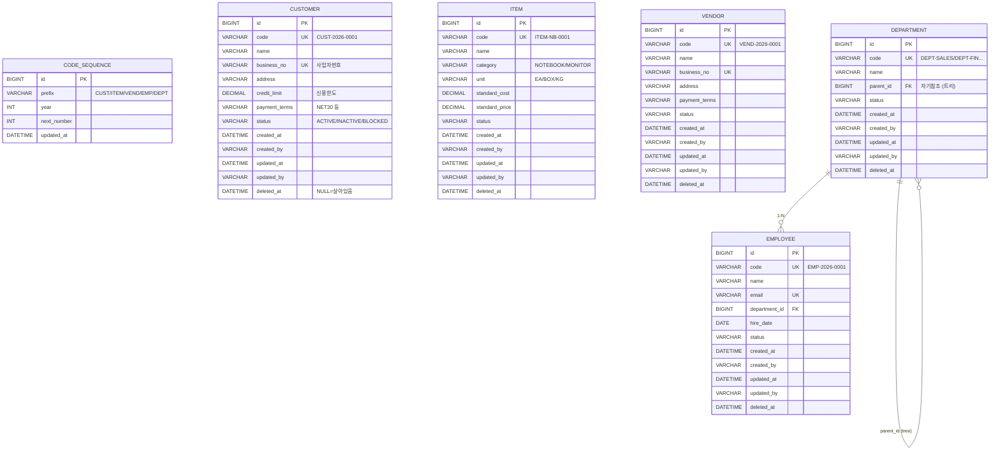

# Phase 1 모델링 제안 — 마스터 데이터 설계

> 7단계 사이클의 **3단계: 모델링 제안**.
> 도메인 브리핑(`1-도메인-브리핑.md`)에서 익힌 개념을 **ERD / 엔티티 구조 / API 명세 / 마이그레이션 계획**으로 변환한다.
> 코드 한 줄 쓰기 전에 "어디까지 구현하고, 무엇은 다음 Phase에 미룰지" 결정한다.
> 이 문서 마지막의 **승인 체크리스트** 에 사용자가 OK 하면 단계 5(코드 구현)로 진입한다.

---

## 0. 한눈에 — 이번 설계의 핵심 결정 7개

| # | 결정 | 한 줄 이유 |
| --- | --- | --- |
| 1 | 공통 베이스 엔티티를 **2단계**로 (`BaseEntity` → `BaseEntityWithCode`) | 마스터/트랜잭션 공통 + 마스터 전용 횡단 관심사 분리 |
| 2 | 코드 자동 생성은 **시퀀스 테이블 + 비관적 락** (도메인 브리핑의 옵션 B) | 동시성 안전 + "왜 락이 필요한가"를 코드로 체감 |
| 3 | Soft Delete는 **`deleted_at`** 컬럼 + `@SQLDelete` / `@SQLRestriction` | 어노테이션으로 자동화, 서비스 코드 단순 |
| 4 | Auditing은 **`AuditorAware`가 `"system"` 고정 반환** (Phase 6에서 교체) | 인증 없이도 4개 컬럼 자동 채움 |
| 5 | **4개 마스터 모두 `status` 필드 둠** (`ACTIVE / INACTIVE / BLOCKED`) | Soft Delete와 별개로 "휴면" 상태 표현 필요 |
| 6 | DTO는 **MapStruct**로 매핑, 도메인별 3종 (`Create/Update/Response`) | 엔티티 직접 노출 금지, 컴파일 타임 안전 |
| 7 | QueryDSL 본격 활용은 **Phase 2부터** | 단순 필터까지만 JPA Method Query/Specification으로 처리 |

---

## 1. 전체 ERD



핵심 관찰:
- **`CODE_SEQUENCE`** 라는 운영 테이블 1개가 모든 마스터의 코드 발급을 통제한다 → 한 곳에서 동시성 관리.
- **`DEPARTMENT`** 만 자기참조 (트리). 나머지 마스터들은 단일 테이블.
- **`EMPLOYEE → DEPARTMENT`** 가 Phase 1에서 유일한 마스터 간 FK.
- 공통 컬럼(`created_*/updated_*/deleted_at/status`)이 모든 마스터에 반복 → BaseEntity로 추출.

---

## 2. 공통 베이스 엔티티 (BaseEntity 계층)

### 2.1 왜 2단 계층인가

- 모든 엔티티 공통 (마스터/트랜잭션 모두): `id`, `created_at/by`, `updated_at/by`
- 마스터 전용: `code`(비즈니스 코드), `status`, `deleted_at` (Soft Delete)
- 미래의 트랜잭션 엔티티(Phase 2~)는 `code` 없이 `id`만 가질 수도 있고, Soft Delete 정책이 다를 수도 있음 (트랜잭션은 보통 "취소" 플래그를 별도로 쓴다).
- 그래서 **두 단계로 분리** → 마스터는 `BaseEntityWithCode`, 미래의 일부 트랜잭션은 `BaseEntity`만 상속 가능.

### 2.2 클래스 구조 (개념적)

```java
// 공통 베이스 — Phase 0의 모든 엔티티에 공통
@MappedSuperclass
@EntityListeners(AuditingEntityListener.class)
public abstract class BaseEntity {
    @Id @GeneratedValue
    private Long id;

    @CreatedDate    private LocalDateTime createdAt;
    @CreatedBy      private String createdBy;
    @LastModifiedDate private LocalDateTime updatedAt;
    @LastModifiedBy  private String updatedBy;
}

// 마스터 데이터 전용 — 코드 + 상태 + Soft Delete
@MappedSuperclass
@SQLDelete(sql = "UPDATE #{table} SET deleted_at = NOW() WHERE id = ?")
@SQLRestriction("deleted_at IS NULL")
public abstract class BaseEntityWithCode extends BaseEntity {
    @Column(nullable = false, unique = true, length = 30)
    private String code;

    @Enumerated(EnumType.STRING)
    @Column(nullable = false, length = 16)
    private MasterStatus status = MasterStatus.ACTIVE;

    private LocalDateTime deletedAt;
}

public enum MasterStatus { ACTIVE, INACTIVE, BLOCKED }
```

> 위 `@SQLDelete`의 `#{table}` 은 의사 코드. 실제로는 **각 엔티티에서 자신의 테이블명을 지정**해야 한다 (`@SQLDelete(sql = "UPDATE customer SET ...")`). 이 부분은 워크스루 단계에서 짚는다.

---

## 3. 각 마스터별 상세 설계

### 3.1 Customer (고객)

| 컬럼 | 타입 | 제약 | 비고 |
| --- | --- | --- | --- |
| `id` | BIGINT | PK, AUTO | 베이스 |
| `code` | VARCHAR(30) | UNIQUE, NOT NULL | `CUST-2026-0001` 형식 |
| `name` | VARCHAR(200) | NOT NULL | 회사명 |
| `business_no` | VARCHAR(20) | UNIQUE, NOT NULL | 사업자번호 (`123-45-67890`) |
| `address` | VARCHAR(500) | NULL | 주소 (구조화 X, 일단 단일 필드) |
| `credit_limit` | DECIMAL(15,2) | NOT NULL, DEFAULT 0 | 신용한도 — Phase 2에서 수주 시 체크 |
| `payment_terms` | VARCHAR(30) | NOT NULL | `NET30`, `NET60`, `COD` 등 enum 문자열 |
| `status` | VARCHAR(16) | NOT NULL | 베이스 |
| `created_at/by`, `updated_at/by`, `deleted_at` | — | — | 베이스 |

**비즈니스 규칙:**
- `business_no`는 유니크 (같은 회사 중복 등록 방지)
- `credit_limit`은 음수 불가 (Bean Validation `@PositiveOrZero`)
- `payment_terms`는 enum으로 시작 (`PaymentTerms.NET30/NET60/COD`)

### 3.2 Item (상품)

| 컬럼 | 타입 | 비고 |
| --- | --- | --- |
| `code` | VARCHAR(30) UK | `ITEM-NB-0001` (카테고리 접두어 포함 검토) |
| `name` | VARCHAR(200) | 상품명 |
| `category` | VARCHAR(20) | enum: `NOTEBOOK`, `MONITOR` (현우전자 초기 2종) |
| `unit` | VARCHAR(10) | enum: `EA`, `BOX`, `KG` |
| `standard_cost` | DECIMAL(15,2) | 표준 원가 — Phase 5 회계 |
| `standard_price` | DECIMAL(15,2) | 표준 판매가 — Phase 2 수주 |
| (베이스 컬럼) |  |  |

**비즈니스 규칙:**
- `standard_price >= standard_cost` 검증은 일단 **하지 않는다** (실무에서는 손해 판매도 가능). Phase 5에서 정책 결정.
- `category` 별로 코드 패턴 분기는 일단 단순화 — 모두 `ITEM-NNNN` 형식. 카테고리 접두어는 학습 포인트가 되지만 시퀀스 테이블 복잡도가 커지므로 보류.

### 3.3 Vendor (거래처)

거의 Customer와 동일하되 `credit_limit`이 없다 (우리가 사는 입장, 신용 평가는 거꾸로).

| 컬럼 | 비고 |
| --- | --- |
| `code` UK | `VEND-2026-0001` |
| `name` |  |
| `business_no` UK |  |
| `address` |  |
| `payment_terms` | 우리가 지불할 조건 |
| (베이스 컬럼) |  |

### 3.4 Department (부서) — 자기참조 트리

| 컬럼 | 비고 |
| --- | --- |
| `code` UK | `DEPT-SALES`, `DEPT-FIN` 등 명시적 코드 (자동 생성 안 함, **수동 등록**) |
| `name` | "영업팀", "재무팀" 등 |
| `parent_id` | FK self → 자기 자신 (NULL이면 루트) |
| (베이스 컬럼) |  |

**왜 부서 코드만 자동 생성 안 하나:**
- 부서는 회사 조직과 1:1. 자주 안 만들고, 의미 있는 이름의 코드(`DEPT-SALES`)가 더 유용.
- 자동 시퀀스(`DEPT-2026-0001`)는 의미 없음 → **수동 입력 + 유니크 검증**으로 진행.

**트리 깊이:**
- Phase 1에서는 2단계만 지원 (회사 → 팀). 재귀 조회는 단순 JOIN으로.
- 깊은 트리(CTE 등) 처리는 Phase 7 HR에서 다룸.

### 3.5 Employee (직원)

| 컬럼 | 비고 |
| --- | --- |
| `code` UK | `EMP-2026-0001` |
| `name` |  |
| `email` UK | 로그인 ID로 쓸 예정 (Phase 6) |
| `department_id` FK | 부서 (NOT NULL) |
| `hire_date` | DATE |
| (베이스 컬럼) |  |

Phase 1 범위에서는 직급/연봉 등은 빼고 핵심만. 확장은 Phase 7에서.

---

## 4. 코드 자동 생성 (CodeSequence)

### 4.1 테이블 설계

```
code_sequence
+----+---------+------+-------------+---------------------+
| id | prefix  | year | next_number | updated_at          |
+----+---------+------+-------------+---------------------+
| 1  | CUST    | 2026 | 1           | 2026-05-14 10:00:00 |
| 2  | ITEM    | 2026 | 1           | ...                 |
| 3  | VEND    | 2026 | 1           | ...                 |
| 4  | EMP     | 2026 | 1           | ...                 |
+----+---------+------+-------------+---------------------+
UNIQUE INDEX (prefix, year)
```

`DEPT`는 자동 생성 안 하므로 행 없음.

### 4.2 발급 로직 (의사 코드)

```java
@Transactional
public String nextCode(String prefix) {
    int year = LocalDate.now().getYear();

    // 비관적 락으로 행을 점유 (다른 트랜잭션 대기)
    CodeSequence seq = repo.findByPrefixAndYearForUpdate(prefix, year)
        .orElseGet(() -> repo.save(new CodeSequence(prefix, year, 1)));

    int n = seq.getNextNumber();
    seq.increment();   // n+1로 갱신

    return String.format("%s-%d-%04d", prefix, year, n);
}
```

- `findByPrefixAndYearForUpdate`는 `SELECT ... FOR UPDATE` 발급. 같은 prefix를 동시 요청한 두 트랜잭션은 줄 서서 처리됨.
- 트랜잭션이 롤백되면 시퀀스도 롤백되어 **번호 구멍이 생기지 않는다** (장점). 단점은 부하 상승.
- 학습 포인트: 동시성 테스트로 "락 없으면 어떻게 깨지는가" 직접 보여줌.

### 4.3 자동 생성 적용 시점

`CustomerService.create()` 호출 시:
1. 트랜잭션 시작
2. `nextCode("CUST")` 호출 → `CUST-2026-0042` 받음
3. Customer 엔티티 생성, code 세팅
4. INSERT
5. 커밋

---

## 5. Soft Delete 통일 정책

- 4개 마스터 모두 `deleted_at` 컬럼
- `BaseEntityWithCode`에 `@SQLDelete`, `@SQLRestriction` 적용
- 서비스 코드에서는 그냥 `repository.delete(customer)` 호출 → 실제로는 UPDATE
- 조회는 `JpaRepository`의 모든 메서드가 자동으로 `WHERE deleted_at IS NULL` 붙음

**예외 케이스:**
- "삭제된 것까지 보고 싶다"는 관리자 화면이 필요할 때는 네이티브 쿼리 또는 별도 Repository 메서드로 우회. Phase 1에서는 **삭제된 행 조회 기능을 만들지 않음**.

**Hard Delete가 필요한 경우:**
- 사업자번호를 잘못 입력해서 등록 직후 바로 지우고 싶다? → 운영 도구로 처리, API로는 열지 않음.

---

## 6. Auditing 설정
누가 언제 이 데이터를 만들었나 / 바꿨나 를 자동으로 기록하는 기능.

### 6.1 활성화

```java
@Configuration
@EnableJpaAuditing(auditorAwareRef = "auditorProvider")
public class JpaAuditingConfig {
    @Bean
    public AuditorAware<String> auditorProvider() {
        // Phase 1: 인증 없음 → 고정 값
        return () -> Optional.of("system");
    }
}
```

### 6.2 Phase 6 전환 예고

```java
// Phase 6 이후 (참고용, Phase 1에서는 안 만듦)
return () -> Optional.ofNullable(SecurityContextHolder.getContext().getAuthentication())
    .map(Authentication::getName);
```

Phase 1에서는 모든 row의 `created_by/updated_by`가 `"system"`으로 채워진다. Phase 6에서 자연스럽게 사용자 ID로 전환.

---

## 7. REST API 설계

### 7.1 엔드포인트 (도메인별 동일 패턴)

각 마스터마다 동일한 6개 API:

| 메서드 | 경로 | 설명 | 응답 |
| --- | --- | --- | --- |
| `POST` | `/api/customers` | 생성 | `201 Created` + 생성된 리소스 |
| `GET` | `/api/customers/{id}` | 단건 조회 (PK 기반) | `200` + 리소스 / `404` |
| `GET` | `/api/customers/by-code/{code}` | 비즈니스 코드로 조회 | 동일 |
| `GET` | `/api/customers` | 목록 조회 (페이징 + 필터) | `200` + `Page<Response>` |
| `PUT` | `/api/customers/{id}` | 수정 | `200` + 갱신된 리소스 |
| `DELETE` | `/api/customers/{id}` | Soft Delete | `204 No Content` |

> **복구(Restore) API는 만들지 않음**. 운영 도구나 DB 직접 작업으로 처리. 학습 범위 단순화.

### 7.2 페이징 + 필터 — Customer 예시

`GET /api/customers?page=0&size=20&sort=name,asc&name=신원&status=ACTIVE&businessNo=123-`

- `page/size/sort`: Spring Data 표준
- `name`: 부분 일치
- `status`: 정확 일치 (enum)
- `businessNo`: prefix 일치

→ **Phase 1에서는 JPA `Specification`** 으로 처리. 5~6개 조건은 충분히 커버.
→ Phase 2부터 조건이 늘어나면 QueryDSL로 자연스럽게 전환.

### 7.3 응답 포맷

학습 단계라 단순화 — **DTO 직접 반환**. `{ "id": 1, "code": "CUST-2026-0001", ... }`

공통 응답 래퍼 (`ApiResponse<T>`)는 의도적으로 **만들지 않음**. 표준 HTTP 상태 코드로 충분.

에러는 `ProblemDetail` (Spring 6 표준, RFC 9457)로 통일.

---

## 8. DTO 전략

각 도메인별 3개 DTO:

| DTO | 용도 | 필드 |
| --- | --- | --- |
| `CustomerCreateRequest` | POST 요청 본문 | `name, businessNo, address, creditLimit, paymentTerms` (code/status/audit는 서버가 채움) |
| `CustomerUpdateRequest` | PUT 요청 본문 | 위와 동일하되 일부는 변경 금지 (`businessNo`는 변경 불가 정책) |
| `CustomerResponse` | 응답 | 모든 외부 노출 필드 (`code, name, ..., status, createdAt, ...`) |

매핑은 **MapStruct**:
```java
@Mapper(componentModel = "spring")
public interface CustomerMapper {
    Customer toEntity(CustomerCreateRequest req);
    void update(@MappingTarget Customer entity, CustomerUpdateRequest req);
    CustomerResponse toResponse(Customer entity);
}
```

### 검증

- `@NotBlank`, `@Size`, `@PositiveOrZero` 등 Bean Validation을 `*Request` DTO에 붙임
- 컨트롤러 메서드에는 `@Valid`

---

## 9. 마이그레이션 계획 (Flyway)

Phase 0의 V1__init.sql 다음으로:

| 버전 | 파일명 | 내용 |
| --- | --- | --- |
| V2 | `V2__create_code_sequence.sql` | `code_sequence` 테이블 |
| V3 | `V3__create_customer.sql` | `customer` 테이블 + 인덱스 |
| V4 | `V4__create_item.sql` | `item` |
| V5 | `V5__create_vendor.sql` | `vendor` |
| V6 | `V6__create_department.sql` | `department` (자기참조 FK 포함) |
| V7 | `V7__create_employee.sql` | `employee` (department FK 포함) |
| V8 | `V8__seed_master_data.sql` | 초기 시드: 부서 트리, 시연용 고객/상품 몇 건 |

**원칙:**
- 한 마이그레이션 = 한 테이블 (역추적 용이)
- 시드는 마지막 V8에 몰아넣되, 트랜잭션 데이터는 절대 시드하지 않음 (마스터만)
- 각 SQL에 주석으로 "왜 이 컬럼이 NOT NULL인지" 등 도메인 의도 기록

---

## 10. 테스트 전략

### 10.1 단위 테스트 (JUnit 5 + AssertJ)

- `CodeGeneratorTest` — 비관적 락 동작, 동시 호출 시 번호가 안 겹치는지 (**핵심 테스트**)
- `CustomerCreateValidationTest` — `business_no` 중복, `credit_limit` 음수 거부
- `SoftDeleteTest` — `delete()` 호출 후 일반 조회에 안 잡히는지

### 10.2 통합 테스트 (Spring Boot Test + Testcontainers)

- `CustomerCrudIntegrationTest` — 생성→조회→수정→삭제 전 사이클
- `CustomerListSearchTest` — 필터/페이징/정렬
- `EmployeeWithDepartmentTest` — FK 관계, JPA 페치 동작

### 10.3 테스트가 곧 명세

"마스터는 물리 삭제 안 됨" 같은 **업무 규칙**이 테스트 메서드 이름이 되도록:
```
@Test
void 삭제된_고객은_일반_목록에서_보이지_않는다()
@Test
void 사업자번호가_중복되면_생성이_거부된다()
@Test
void 코드_생성은_동시_요청에서도_중복되지_않는다()
```

---

## 11. 의도적으로 미루는 것 (Phase 1 범위 밖)

| 항목 | 미루는 이유 | 도입 시점 |
| --- | --- | --- |
| QueryDSL | 단순 필터는 Specification으로 충분 | Phase 2 (수주 조회 복잡도 ↑) |
| 사용자 인증 (Spring Security) | 마스터 학습에 집중 | Phase 6 |
| 변경 이력 (Envers — 전후 값) | `created_at/updated_at`까지로 충분 | Phase 6 (감사 로그) |
| 캐싱 (Redis) | 학습 초기 캐싱은 오버엔지니어링 | 후반 |
| 다국어 / 다주소 / 다결제조건 | 학습 초점 흐림 | 학습 범위 밖 |
| 복구 API (`PATCH /customers/{id}/restore`) | 운영 도구 영역 | 학습 범위 밖 |
| 부서 깊은 트리 (CTE) | 2단 트리로 충분 | Phase 7 HR |
| 상품 카테고리별 코드 패턴 분기 | 단일 `ITEM-NNNN`으로 시작 | 필요해질 때 |

---

## 12. 디렉토리 구조 (구현 시 만들 패키지)

```
hwlee-erp/src/main/java/com/hwlee/erp/
├─ common/
│  ├─ entity/
│  │  ├─ BaseEntity.java
│  │  ├─ BaseEntityWithCode.java
│  │  └─ MasterStatus.java
│  ├─ audit/
│  │  └─ JpaAuditingConfig.java
│  ├─ code/
│  │  ├─ CodeSequence.java
│  │  ├─ CodeSequenceRepository.java
│  │  └─ CodeGenerator.java
│  └─ error/
│     └─ GlobalExceptionHandler.java
└─ master/
   ├─ customer/
   │  ├─ Customer.java
   │  ├─ CustomerRepository.java
   │  ├─ CustomerService.java
   │  ├─ CustomerController.java
   │  ├─ CustomerMapper.java
   │  └─ dto/
   │     ├─ CustomerCreateRequest.java
   │     ├─ CustomerUpdateRequest.java
   │     └─ CustomerResponse.java
   ├─ item/        (동일 구조)
   ├─ vendor/      (동일 구조)
   ├─ department/  (동일 구조)
   └─ employee/    (동일 구조)
```

각 도메인 모듈이 5단(`controller/service/엔티티/리포지토리/dto`) 일관 구조.

---

## 13. 승인 체크리스트 ⭐

아래 항목을 하나씩 짚어보고, **수정/이의 있는 항목이 있으면 번호로 알려 주세요.** 다 OK면 "승인"이라고 답해 주시면 단계 5(코드 구현)로 진입합니다.

- [ ] **1.** `BaseEntity` / `BaseEntityWithCode` 2단 베이스 구조
- [ ] **2.** 코드 자동 생성 = `code_sequence` 테이블 + 비관적 락 (옵션 B)
- [ ] **3.** `DEPARTMENT`만 코드 수동 입력 (자동 생성 X)
- [ ] **4.** 4개 마스터 모두 `status` 필드 (`ACTIVE/INACTIVE/BLOCKED`)
- [ ] **5.** Soft Delete = `deleted_at` + `@SQLDelete` + `@SQLRestriction`
- [ ] **6.** Auditing = `AuditorAware`가 `"system"` 고정 반환 (Phase 6에서 교체)
- [ ] **7.** 도메인별 API 6종 (생성/단건조회/코드조회/목록조회/수정/삭제), 복구 API 없음
- [ ] **8.** 페이징/필터 = JPA `Specification`, QueryDSL은 Phase 2부터
- [ ] **9.** DTO = `Create/Update/Response` 3종 + MapStruct
- [ ] **10.** 마이그레이션 V2~V8 분리 (한 파일 = 한 테이블, V8은 시드)
- [ ] **11.** 테스트는 단위(코드 생성 동시성/Soft Delete) + 통합(CRUD 전 사이클) 위주
- [ ] **12.** 미루는 것 11개 항목 (QueryDSL, 인증, Envers, 캐싱, ...)

---

## 14. 다음 단계 안내

승인되면 **단계 5: 코드 구현**으로 들어갑니다. 다음 산출물:
- `hwlee-erp/src/main/...` 아래 13개 패키지의 Java 파일들
- `db/migration/V2~V8.sql`
- 단위/통합 테스트
- 그리고 단계 6: **코드 워크스루** 문서 (`3-코드-워크스루/01-BaseEntity.md`, `02-CodeSequence.md`, ... 식으로 분할)

> 도메인 브리핑에서 짚고 싶은 부분이 더 있거나 (자기 점검 1·2·4·5번), 위 13가지 결정 중 다시 들춰보고 싶은 항목이 있으면 그것부터 풀고 진행해도 됩니다.
