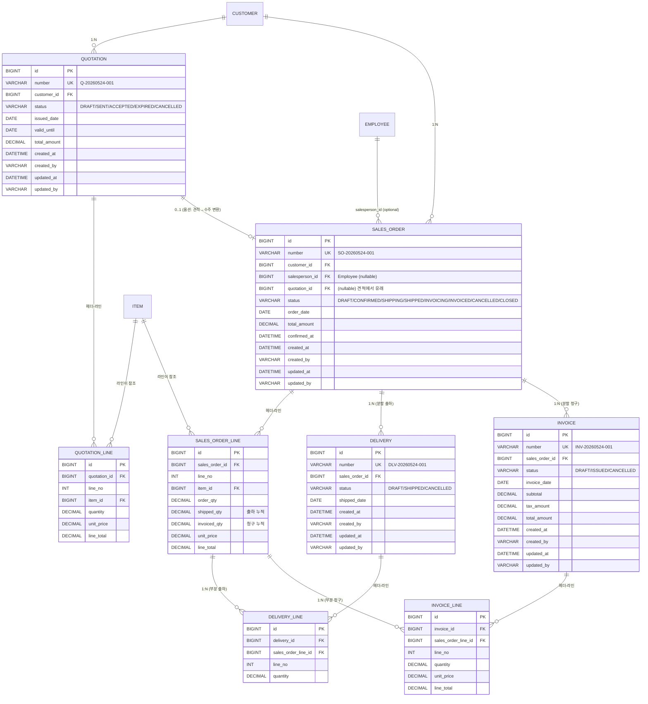

# Phase 2 모델링 제안 — SD(영업) 트랜잭션 설계

> 7단계 사이클의 **3단계: 모델링 제안**.
> 도메인 브리핑(`1-도메인-브리핑.md`)에서 정리한 OTC 흐름과 5대 특성(헤더-라인 / 상태 전이 / 트랜잭션 번호 / 마스터 참조 / 금액 계산)을 **ERD / 엔티티 / 상태 머신 / API / 마이그레이션 계획**으로 변환한다.
> 코드 한 줄 쓰기 전에 "어디까지 구현하고, 무엇은 다음 Phase에 미룰지" 결정한다.
> 이 문서 마지막의 **승인 체크리스트** 에 사용자가 OK 하면 단계 5(코드 구현)로 진입한다.

---

## 0. 한눈에 — 이번 설계의 핵심 결정 10개

| # | 결정 | 한 줄 이유 |
| --- | --- | --- |
| 1 | 4개 트랜잭션 도메인: **Quotation / SalesOrder / Delivery / Invoice** (각각 헤더-라인 2테이블) | OTC 흐름의 절반을 4개 모듈로 표현 |
| 2 | 트랜잭션은 **`BaseEntity` 만 상속** — Soft Delete 미적용 | 트랜잭션은 물리 삭제 불가, `CANCELLED` 상태로 표현 |
| 3 | 트랜잭션 번호 = **prefix + YYYYMMDD + 일련번호** (`SO-20260524-001`) | 회계 마감/조회의 일자 기반 검색 편의 |
| 4 | Phase 1 `code_sequence` 를 **확장**해서 같이 사용 (year 컬럼을 `period_key`로 일반화) | 한 테이블에서 마스터/트랜잭션 시퀀스 통합, 비관적 락 패턴 그대로 재사용 |
| 5 | 헤더-라인 = `@OneToMany cascade=ALL, orphanRemoval=true`, **FetchType.LAZY** 디폴트 | 한 트랜잭션으로 헤더+라인 관리, N+1은 fetch join으로 해결 |
| 6 | 헤더 총액(`total_amount`)을 **DB에 저장** (Denormalization) | 조회/리포트 성능 — 라인 변경 메서드 안에서 즉시 재계산 강제 |
| 7 | 부분 출하/인보이스 추적은 **수주 라인의 `shipped_qty`, `invoiced_qty` 누적값** | 한 곳(SO 라인)이 모든 부분 진행 상태의 단일 진실 |
| 8 | Delivery/Invoice 라인은 **`sales_order_line_id` 를 직접 FK 참조** | 수주 라인 단위로 부분 출하/청구를 명확히 |
| 9 | 신용한도 체크는 **Service 단 + `confirm()` 시점** (DRAFT에서는 한도 무영향) | 외부 의존(다른 SO 합계 조회)이라 도메인 메서드 안에 못 둠 |
| 10 | 상태 변경은 **도메인 메서드만**, `setStatus()` 비공개 — `status` 자체는 라인이 아닌 헤더에만 | 상태 머신을 한 곳에서 관리, 라인 상태는 누적 수치로 파생 |

---

## 1. 전체 ERD



핵심 관찰:
- **Customer / Item / Employee** 는 Phase 1 마스터 — 트랜잭션이 단방향으로 가리킬 뿐, 마스터엔 변경 없음.
- **수주 라인(`sales_order_line`)이 OTC 중심축** — 출하 라인/청구 라인이 모두 SO 라인을 직접 가리킨다. "이 SO 라인 10대 중 6대 보냈고 6대 청구했다" 가 한 행으로 추적된다.
- **Quotation → SalesOrder 는 선택적 1:1** — 견적 없이 수주 직행도 허용 (실무에서 흔함). FK는 nullable.
- **헤더 상태는 enum** , 라인 상태는 별도 컬럼 두지 않음 — `shipped_qty / order_qty` 비율로 라인의 진행 상태가 자연스럽게 드러난다.

---

## 2. 베이스 엔티티 — 마스터와 무엇이 다른가

### 2.1 트랜잭션은 Soft Delete 안 한다

Phase 1의 `BaseEntityWithCode` 는 `@SQLDelete` / `@SQLRestriction` / `deleted_at` 을 가졌다. 트랜잭션에 그대로 적용하면 안 된다:

- 트랜잭션은 **물리 삭제 자체가 금기** (감사 추적). Soft Delete 형식의 "지운 표식"도 필요 없음.
- 잘못 입력했다 → `CANCELLED` 상태로 둔다. 그러면 일반 목록에는 안 나오지만 (혹은 필터로 빠지지만), 행은 그대로 남고 감사 추적 가능.
- 마스터의 `WHERE deleted_at IS NULL` 자동 필터가 트랜잭션엔 안 어울린다 (취소된 거래도 종종 조회해야 함).

### 2.2 두 가지 옵션, 무엇을 채택할까

**옵션 A — `BaseEntity` 만 상속, `number` 컬럼은 각 엔티티가 직접 선언**
```java
@Entity
@Table(name = "sales_order")
class SalesOrder extends BaseEntity {
    @Column(nullable = false, unique = true, length = 30)
    private String number;
    @Enumerated(EnumType.STRING)
    private SalesOrderStatus status;
    ...
}
```

**옵션 B — 새 베이스 `BaseTransactionEntity` 도입** (`number` + 헬퍼 메서드)
```java
@MappedSuperclass
abstract class BaseTransactionEntity extends BaseEntity {
    @Column(nullable = false, unique = true, length = 30)
    private String number;
}
```

→ **옵션 A 채택**. 이유:
- Phase 2에 트랜잭션이 4종이지만, 상태 enum 타입이 모두 다르고 라인 컬렉션 타입도 모두 다르다. 공통화로 묶을 게 결국 `number` 한 컬럼.
- 한 컬럼을 위해 베이스 클래스를 새로 만드는 건 과한 추상화 — Phase 1 메모 "성급한 추상화 금지" 정신과도 맞음.
- 추후 트랜잭션 모듈이 더 늘어 공통 행위(취소 가능 여부 등)가 명확해지면 그때 추출.

### 2.3 도메인 메서드 패턴

상태 변경은 도메인 메서드로만:

```java
@Entity
class SalesOrder extends BaseEntity {
    @Column(nullable = false, unique = true, length = 30)
    private String number;

    @ManyToOne(fetch = LAZY) @JoinColumn(name = "customer_id")
    private Customer customer;

    @Enumerated(EnumType.STRING)
    @Column(nullable = false, length = 16)
    private SalesOrderStatus status = SalesOrderStatus.DRAFT;

    @OneToMany(mappedBy = "salesOrder", cascade = ALL, orphanRemoval = true)
    private List<SalesOrderLine> lines = new ArrayList<>();

    @Column(precision = 15, scale = 2, nullable = false)
    private BigDecimal totalAmount = BigDecimal.ZERO;

    // === 도메인 메서드 ===
    public void addLine(Item item, BigDecimal qty, BigDecimal unitPrice) {
        ensureEditable();
        var line = new SalesOrderLine(this, lines.size() + 1, item, qty, unitPrice);
        lines.add(line);
        recalculateTotal();
    }

    public void confirm() {
        if (status != DRAFT) throw new IllegalStateException("DRAFT 만 확정 가능");
        if (lines.isEmpty()) throw new IllegalStateException("라인이 비어 있음");
        // 신용한도 검증은 Service 단에서 호출 직전에 처리
        this.status = CONFIRMED;
        this.confirmedAt = LocalDateTime.now();
    }

    public void recordShipment(SalesOrderLine line, BigDecimal qty) {
        if (status != CONFIRMED && status != SHIPPING)
            throw new IllegalStateException("출하 가능 상태가 아님");
        line.addShippedQty(qty);
        this.status = isAllShipped() ? SHIPPED : SHIPPING;
    }

    private void ensureEditable() {
        if (status != DRAFT)
            throw new IllegalStateException("DRAFT 상태에서만 라인 수정 가능");
    }

    // setStatus(), setLines() 등은 절대 노출하지 않는다
}
```

요점:
- 상태 변경, 라인 추가, 총액 재계산이 **모두 도메인 메서드 내부에서 묶여서 일어난다**.
- 외부 의존이 필요한 규칙(신용한도)은 Service 단에서 메서드 호출 직전에 처리.

---

## 3. 각 트랜잭션별 상세 설계

### 3.1 Quotation (견적)

**용도**: 고객에게 가격 제안. 학습 목적상 최소 기능만.

| 컬럼 | 타입 | 제약 | 비고 |
| --- | --- | --- | --- |
| `id` | BIGINT | PK | 베이스 |
| `number` | VARCHAR(30) | UNIQUE NOT NULL | `Q-20260524-001` |
| `customer_id` | BIGINT | FK NOT NULL | Customer |
| `status` | VARCHAR(16) | NOT NULL | `DRAFT / SENT / ACCEPTED / EXPIRED / CANCELLED` |
| `issued_date` | DATE | NOT NULL | 발행일 |
| `valid_until` | DATE | NULL | 유효 기한 (NULL = 미지정) |
| `total_amount` | DECIMAL(15,2) | NOT NULL DEFAULT 0 |  |

**상태 전이:**
```
DRAFT → SENT → ACCEPTED → (SO 생성 시 quotation_id 채워짐)
                     ↘ EXPIRED  (valid_until 지남)
        ↘ CANCELLED
```

**Phase 2 학습 범위**: 견적 자체는 단순. 핵심은 **"견적 → 수주 변환" 흐름** — `SalesOrder` 생성 시 `quotation_id` 를 채워 추적성을 남긴다 (옵션).

#### Quotation Line
| 컬럼 | 비고 |
| --- | --- |
| `quotation_id` FK |  |
| `line_no` | 1, 2, 3... |
| `item_id` FK | Item |
| `quantity` DECIMAL |  |
| `unit_price` DECIMAL |  |
| `line_total` DECIMAL | qty × unit_price (라인 단위 부가세는 견적엔 없음) |

### 3.2 SalesOrder (수주) — Phase 2 의 핵심

| 컬럼 | 타입 | 비고 |
| --- | --- | --- |
| `number` | VARCHAR(30) UK | `SO-20260524-001` |
| `customer_id` | FK NOT NULL | Customer |
| `salesperson_id` | FK NULL | Employee (담당자, 선택) |
| `quotation_id` | FK NULL | 견적에서 유래한 경우 |
| `status` | VARCHAR(16) | `DRAFT / CONFIRMED / SHIPPING / SHIPPED / INVOICING / INVOICED / CANCELLED / CLOSED` |
| `order_date` | DATE NOT NULL | 주문일 (= 보통 등록일) |
| `confirmed_at` | DATETIME NULL | 확정 시각 (감사용) |
| `total_amount` | DECIMAL(15,2) NOT NULL | 라인 합계, 도메인 메서드로 재계산 |

**상태 전이:**
```
DRAFT
  │ confirm()  [신용한도 검증 통과]
  ▼
CONFIRMED
  │ recordShipment(line, qty)  [부분]
  ▼
SHIPPING ─────────── recordShipment(...) → isAllShipped()? → SHIPPED
                                         (남은 라인 있으면 SHIPPING 유지)
SHIPPED
  │ recordInvoicing(line, qty)
  ▼
INVOICING ────────── isAllInvoiced()? → INVOICED
INVOICED
  │ (Phase 5: 수금 완료) → CLOSED

(예외)
DRAFT/CONFIRMED → CANCELLED   (CONFIRMED 후 취소는 신용한도 복원 + 라인 검증)
SHIPPING/SHIPPED 이후 → 직접 취소 X  (반품/반제 흐름은 학습 범위 밖)
```

#### SalesOrder Line — 부분 출하/청구의 단일 진실
| 컬럼 | 타입 | 비고 |
| --- | --- | --- |
| `sales_order_id` FK |  |  |
| `line_no` | INT | 1부터 |
| `item_id` FK | NOT NULL | Item |
| `order_qty` | DECIMAL(15,4) | 주문량 (불변 — 확정 후 변경 시 별도 흐름 필요, 학습 범위 밖) |
| `shipped_qty` | DECIMAL(15,4) DEFAULT 0 | 출하 누적 |
| `invoiced_qty` | DECIMAL(15,4) DEFAULT 0 | 청구 누적 |
| `unit_price` | DECIMAL(15,2) | 라인 단가 |
| `line_total` | DECIMAL(15,2) | qty × unit_price (부가세 별도) |

**불변 조건 (도메인 메서드에서 검증)**:
- `shipped_qty ≤ order_qty`
- `invoiced_qty ≤ shipped_qty` — 보낸 만큼만 청구 가능

> **`order_qty` 가 왜 DECIMAL인가** — 상품 단위가 `EA` (정수) 인 경우가 대부분이지만, 무게/길이 단위 상품은 소수일 수 있음. Phase 1 Item 마스터가 다양한 unit 을 가지므로 일반화.

### 3.3 Delivery (출하)

| 컬럼 | 비고 |
| --- | --- |
| `number` UK | `DLV-20260524-001` |
| `sales_order_id` FK NOT NULL | 한 출하는 한 수주에 속함 |
| `status` | `DRAFT / SHIPPED / CANCELLED` (단순) |
| `shipped_date` DATE | 출하일 |

**상태 전이:**
```
DRAFT
  │ ship()  [라인이 비어있지 않고, 각 라인 qty 가 잔여 출하 가능량 이하인지 검증]
  ▼
SHIPPED   (확정. 이후 수정 불가, 취소만)
  │ cancel()  [SO 라인의 shipped_qty 차감]
  ▼
CANCELLED
```

`SHIPPED` 시점에 SO 라인의 `shipped_qty` 가 증가하고, SO 헤더의 상태가 `SHIPPING` 또는 `SHIPPED` 로 변한다.

#### Delivery Line
| 컬럼 | 비고 |
| --- | --- |
| `delivery_id` FK |  |
| `sales_order_line_id` FK | **SO 라인 직접 참조** |
| `line_no` | INT |
| `quantity` | DECIMAL — 이번 출하분 |

**검증**: `quantity ≤ (sol.order_qty - sol.shipped_qty)` — 잔여 출하 가능량 초과 금지.

> **왜 출하 라인이 `item_id` 를 안 들고 SO 라인만 가리키나** — SO 라인이 이미 `item_id` 를 갖고 있고, 출하는 "이 SO 라인의 일부" 가 본질. item 을 따로 들면 SO 라인의 item 과 어긋날 위험. 조회는 `sol.item` 으로 한 단계 거치면 됨.

### 3.4 Invoice (인보이스 / 세금계산서)

| 컬럼 | 비고 |
| --- | --- |
| `number` UK | `INV-20260524-001` |
| `sales_order_id` FK NOT NULL | 한 인보이스는 한 수주에 속함 |
| `status` | `DRAFT / ISSUED / CANCELLED` |
| `invoice_date` DATE | 발행일 (회계 마감의 기준일) |
| `subtotal` DECIMAL(15,2) | 공급가액 (부가세 제외) |
| `tax_amount` DECIMAL(15,2) | 부가세 |
| `total_amount` DECIMAL(15,2) | subtotal + tax_amount |

**상태 전이:**
```
DRAFT
  │ issue()  [출하된 수량 이하인지 검증]
  ▼
ISSUED
  │ cancel()  [SO 라인의 invoiced_qty 차감]
  ▼
CANCELLED
```

**부가세 처리** (Phase 2 단순화):
- 라인 단위 `line_total` 은 **공급가**.
- 헤더 `subtotal = SUM(line_total)`, `tax_amount = subtotal × 0.10`, `total_amount = subtotal + tax_amount`.
- 한국 부가세 10% 고정. 면세 / 영세율 / 다국가는 학습 범위 밖.

#### Invoice Line
| 컬럼 | 비고 |
| --- | --- |
| `invoice_id` FK |  |
| `sales_order_line_id` FK | SO 라인 참조 |
| `line_no` |  |
| `quantity` | 이번 청구분 |
| `unit_price` | SO 라인 단가 그대로 복사 (가격 일관성 + 미래 단가 변경 영향 차단) |
| `line_total` | qty × unit_price |

**검증**: `quantity ≤ (sol.shipped_qty - sol.invoiced_qty)` — 보낸 것 중 미청구분 이하.

> **왜 인보이스 라인이 단가를 복사하나** — Phase 1 Item 마스터의 표준판매가가 미래에 바뀌어도, 이미 발행된 인보이스 금액은 그대로여야 한다 (회계 보존). SO 라인이 이미 그날의 단가를 동결한 것을 인보이스가 한 번 더 복사.

---

## 4. 트랜잭션 번호 발급 (CodeSequence 확장)

### 4.1 Phase 1 `code_sequence` 를 어떻게 살리나

Phase 1의 테이블:
```
code_sequence
  prefix      VARCHAR
  year        INT
  next_number INT
  UNIQUE (prefix, year)
```

Phase 2의 요구: 같은 prefix(`SO`)에 대해 **날짜 단위로 next&#95;number 가 리셋**.

**옵션 A — 새 컬럼 추가, 기존은 그대로**
```sql
ALTER TABLE code_sequence
  ADD COLUMN period_key VARCHAR(8) NULL COMMENT '연 단위면 YYYY, 일 단위면 YYYYMMDD';

-- 마스터는 `year` 컬럼을 계속 쓰고, 트랜잭션은 `period_key` 사용
```

**옵션 B — `year` 컬럼을 일반화한 `period_key VARCHAR(8)` 로 변경 (이중 컬럼 없이)**
```sql
-- year 컬럼을 period_key 로 rename, 모두 문자열 처리
-- 마스터: '2026', 트랜잭션: '20260524'
```

**옵션 C — 새 테이블 `transaction_sequence` 분리**
```
transaction_sequence
  prefix      VARCHAR
  period_key  VARCHAR(8)   -- YYYYMMDD
  next_number INT
```

→ **옵션 B 채택**. 이유:
- Phase 1 데이터(`year=2026`) 가 `period_key='2026'` 으로 자연스럽게 보존됨 (Flyway 마이그레이션으로 변환).
- 한 테이블만 운영 → 비관적 락 패턴 / Repository / `CodeGenerator` 코드를 그대로 재사용.
- `CodeGenerator` 시그니처: `nextCode(prefix, periodKey)` 로 일반화. 마스터는 `"2026"`, 트랜잭션은 `"20260524"` 를 넘김.
- 단점: `code_sequence` 컬럼명/타입 변경이 Phase 1 이후 첫 destructive change. **Flyway V9 마이그레이션으로 안전하게 변환** (`ALTER TABLE ... CHANGE COLUMN year period_key VARCHAR(8)`).

### 4.2 발급 헬퍼

```java
public class TransactionNumberGenerator {
    private final CodeGenerator delegate;

    public String nextSalesOrderNumber(LocalDate orderDate) {
        return delegate.nextCode("SO", orderDate.format(YYYYMMDD));
    }
    // nextQuotationNumber / nextDeliveryNumber / nextInvoiceNumber 동일 패턴
}
```

기존 `CodeGenerator` 가 `nextCode(prefix, periodKey)` 로 일반화되면, 마스터 쪽도 한 줄만 바꾸면 된다 (`nextCode("CUST", String.valueOf(year))`).

---

## 5. 핵심 업무 로직

### 5.1 신용한도 검증 (수주 `confirm`)

```java
@Service
@RequiredArgsConstructor
public class SalesOrderService {
    private final SalesOrderRepository repo;
    private final CustomerRepository customerRepo;

    @Transactional
    public void confirm(Long orderId) {
        SalesOrder order = repo.findById(orderId)
            .orElseThrow(() -> new ResourceNotFoundException("SO not found"));

        Customer customer = order.getCustomer();
        if (customer.getStatus() != ACTIVE) {
            throw new BusinessException("거래 불가 고객: " + customer.getStatus());
        }

        BigDecimal used = repo.sumActiveOrderAmountByCustomer(customer.getId());
        BigDecimal remaining = customer.getCreditLimit().subtract(used);
        if (order.getTotalAmount().compareTo(remaining) > 0) {
            throw new BusinessException(
                "신용한도 초과: 남은 한도 " + remaining + ", 요청 " + order.getTotalAmount());
        }

        order.confirm();   // 도메인 메서드 — 자기 상태만 검증 후 DRAFT → CONFIRMED
    }
}
```

`sumActiveOrderAmountByCustomer` 의 정의:
- `WHERE customer_id = ? AND status IN ('CONFIRMED', 'SHIPPING', 'SHIPPED', 'INVOICING', 'INVOICED')`
- `CANCELLED / CLOSED / DRAFT` 는 한도 영향 없음.

**동시성 고려** (학습 포인트):
- 두 트랜잭션이 같은 고객의 한도를 동시에 차감하려고 할 수 있음.
- **Phase 2에서는 일단 비관적 락 없이** 진행 → 통합 테스트에서 race condition 을 의도적으로 보여주고, Phase 3(MM 재고)에서 락 패턴을 본격적으로 도입할 때 같이 다룬다.
- 또는 `Customer` 엔티티에 `@Version` 으로 낙관적 락만 가볍게 걸어두고 재시도 — 결정은 단계 4(승인) 때.

### 5.2 부분 출하 등록 (`Delivery.ship()`)

```java
@Service
public class DeliveryService {
    @Transactional
    public Long create(DeliveryCreateRequest req) {
        SalesOrder so = ...; // 조회
        Delivery dlv = Delivery.draft(so, req.getShippedDate());

        for (var lineReq : req.getLines()) {
            SalesOrderLine sol = so.findLineById(lineReq.getSalesOrderLineId());
            dlv.addLine(sol, lineReq.getQuantity());  // 잔여 검증은 여기서
        }

        dlv.ship();   // 헤더 상태 DRAFT → SHIPPED
        // SO 라인의 shipped_qty 업데이트 + SO 상태 전이
        for (var dlvLine : dlv.getLines()) {
            so.recordShipment(dlvLine.getSalesOrderLine(), dlvLine.getQuantity());
        }

        return deliveryRepo.save(dlv).getId();
    }
}
```

요점:
- 같은 트랜잭션 안에서 `Delivery` 와 `SalesOrder.lines` 가 동시에 갱신됨 → `@Transactional` 하나로 묶임.
- 잔여 검증은 도메인 메서드(`dlv.addLine`, `so.recordShipment`)가 책임.

### 5.3 부분 인보이스 발행 (`Invoice.issue()`)

`Delivery` 와 거의 같은 패턴. 단, 검증은 `quantity ≤ (sol.shipped_qty - sol.invoiced_qty)`.

### 5.4 헤더 총액 재계산

`SalesOrder` 안에서:
```java
private void recalculateTotal() {
    this.totalAmount = lines.stream()
        .map(SalesOrderLine::getLineTotal)
        .reduce(BigDecimal.ZERO, BigDecimal::add);
}
```

`addLine / removeLine / changeLineQty` 모두 마지막에 `recalculateTotal()` 호출. 외부에서 `total_amount` 를 직접 세팅할 수 없도록 setter 비공개.

---

## 6. REST API 설계

### 6.1 엔드포인트 (도메인별)

#### Quotation (`/api/quotations`)
| 메서드 | 경로 | 설명 |
| --- | --- | --- |
| POST | `/api/quotations` | 견적 생성 (DRAFT) |
| GET | `/api/quotations/{id}` | 단건 |
| GET | `/api/quotations` | 목록 (페이징 + 필터: customerId, status, dateFrom/To) |
| PUT | `/api/quotations/{id}` | 수정 (DRAFT 한정) |
| POST | `/api/quotations/{id}/send` | 상태 SENT 로 전이 |
| POST | `/api/quotations/{id}/cancel` | 취소 |

#### SalesOrder (`/api/sales-orders`)
| 메서드 | 경로 | 설명 |
| --- | --- | --- |
| POST | `/api/sales-orders` | 수주 생성 (DRAFT) — 견적 ID 옵션 |
| GET | `/api/sales-orders/{id}` | 단건 (헤더 + 라인) |
| GET | `/api/sales-orders` | 목록 (customerId, status, dateFrom/To, salespersonId) |
| PUT | `/api/sales-orders/{id}` | 수정 (DRAFT 한정) |
| POST | `/api/sales-orders/{id}/confirm` | DRAFT → CONFIRMED (신용한도 검증) |
| POST | `/api/sales-orders/{id}/cancel` | 취소 |

#### Delivery (`/api/deliveries`)
| 메서드 | 경로 | 설명 |
| --- | --- | --- |
| POST | `/api/deliveries` | 출하 등록 — 본문에 `salesOrderId` + 라인별 출하 수량 |
| GET | `/api/deliveries/{id}` | 단건 |
| GET | `/api/deliveries` | 목록 |
| POST | `/api/deliveries/{id}/cancel` | 취소 (SO 라인 shipped_qty 복원) |

#### Invoice (`/api/invoices`)
| 메서드 | 경로 | 설명 |
| --- | --- | --- |
| POST | `/api/invoices` | 인보이스 생성 (DRAFT) — `salesOrderId` + 청구 라인 |
| POST | `/api/invoices/{id}/issue` | DRAFT → ISSUED |
| GET | `/api/invoices/{id}` |  |
| GET | `/api/invoices` | 목록 |
| POST | `/api/invoices/{id}/cancel` | 취소 (SO 라인 invoiced_qty 복원) |

### 6.2 상태 전이는 별도 엔드포인트로

Phase 1의 마스터는 `PUT` 하나가 다였지만, 트랜잭션은 **상태 전이 액션마다 별도 엔드포인트**가 자연스럽다:
- 본문 없이 `POST /api/sales-orders/{id}/confirm` 호출.
- 클라이언트(향후 화면)는 "수주 확정 버튼" 누르면 이 엔드포인트.
- 의미가 자명해 Swagger 에서 보기에도 명확.

> 대안: `PATCH /api/sales-orders/{id}` 본문에 `{ "action": "confirm" }`. 더 RESTful 같지만 의미 모호. Phase 2는 액션별 엔드포인트로 시작 — Phase 8쯤 컨벤션 통일 검토.

### 6.3 DTO

각 트랜잭션마다 다음 세트:
- `{Entity}CreateRequest` — 헤더 + 라인 한 번에
- `{Entity}UpdateRequest` — DRAFT 한정
- `{Entity}Response` — 헤더 + 라인 (라인은 `LineResponse` 내부 클래스 또는 별도)
- `{Entity}LineCreateRequest` — 라인 요청
- `{Entity}LineResponse` — 라인 응답

MapStruct로 일관 매핑. 라인 컬렉션은 `@Mapping(target = "...")` 으로 명시 매핑.

---

## 7. 패키지 구조

```
hwlee-erp/src/main/java/com/hwlee/erp/
├─ common/
│  └─ code/   ← 기존 — CodeGenerator 시그니처만 확장
└─ sd/        ← 새 모듈
   ├─ TransactionNumberGenerator.java   ← CodeGenerator 래퍼
   ├─ quotation/
   │  ├─ Quotation.java
   │  ├─ QuotationLine.java
   │  ├─ QuotationStatus.java (enum)
   │  ├─ QuotationRepository.java
   │  ├─ QuotationService.java
   │  ├─ QuotationController.java
   │  ├─ QuotationMapper.java
   │  └─ dto/
   ├─ order/
   │  ├─ SalesOrder.java
   │  ├─ SalesOrderLine.java
   │  ├─ SalesOrderStatus.java
   │  ├─ SalesOrderRepository.java
   │  ├─ SalesOrderService.java
   │  ├─ SalesOrderController.java
   │  ├─ SalesOrderMapper.java
   │  ├─ creditcheck/
   │  │  └─ CreditLimitChecker.java   ← 한도 검증 도우미
   │  └─ dto/
   ├─ delivery/
   │  ├─ Delivery.java
   │  ├─ DeliveryLine.java
   │  ├─ DeliveryStatus.java
   │  ├─ DeliveryRepository.java
   │  ├─ DeliveryService.java
   │  ├─ DeliveryController.java
   │  ├─ DeliveryMapper.java
   │  └─ dto/
   └─ invoice/
      ├─ Invoice.java
      ├─ InvoiceLine.java
      ├─ InvoiceStatus.java
      ├─ InvoiceRepository.java
      ├─ InvoiceService.java
      ├─ InvoiceController.java
      ├─ InvoiceMapper.java
      └─ dto/
```

원칙:
- 모듈명 = `sd/` (학습 계획서의 SAP 모듈 명명을 따른다 — 추후 mm/fi/hr/pp 와 일관).
- 각 도메인 내부 구조는 Phase 1 마스터 모듈과 동일 (controller/service/엔티티/리포지토리/dto/mapper).

---

## 8. 마이그레이션 계획 (Flyway V9~)

| 버전 | 파일명 | 내용 |
| --- | --- | --- |
| V9 | `V9__alter_code_sequence_period_key.sql` | `year INT` → `period_key VARCHAR(8)`, 기존 값 `'YYYY'` 문자열로 보존. UNIQUE 제약도 `(prefix, period_key)` 로 갱신 |
| V10 | `V10__create_quotation.sql` | quotation, quotation_line |
| V11 | `V11__create_sales_order.sql` | sales_order, sales_order_line (Customer/Item/Employee FK + Quotation 옵션 FK) |
| V12 | `V12__create_delivery.sql` | delivery, delivery_line (SO FK, SOL FK) |
| V13 | `V13__create_invoice.sql` | invoice, invoice_line (SO FK, SOL FK) |
| V14 | `V14__seed_sd_demo.sql` | 시연용 시드: 신원전자 DRAFT 견적 1건 + DRAFT 수주 1건 (라인 2개). 출하/인보이스는 시드하지 않음 — 시연에서 직접 만들 것 |

원칙(Phase 1과 동일):
- **한 마이그레이션 = 한 단위**.
- **시드는 마지막 한 파일에** (V14).
- 각 SQL에 도메인 주석 (`-- 부분 출하 추적용 / -- 회계 보존 위해 가격 동결 ...`)

**`V9` 의 주의**:
```sql
-- 기존 데이터를 보존하며 컬럼 변경
ALTER TABLE code_sequence
  CHANGE COLUMN year period_key VARCHAR(8) NOT NULL;
-- UNIQUE 제약 자동 유지 (MySQL 은 컬럼 이름 변경에 인덱스 따라옴)
-- 검증
SELECT prefix, period_key, next_number FROM code_sequence;
-- 기대: prefix=CUST, period_key='2026', next_number=3 등 (Phase 1 V8 시드의 후속)
```

---

## 9. 테스트 전략

### 9.1 단위 테스트 (도메인 메서드 중심)

`SalesOrderTest`:
- `confirm_DRAFT가_아니면_거부된다`
- `confirm_라인이_비어있으면_거부된다`
- `addLine_확정된_수주는_라인_추가_불가`
- `recordShipment_주문량_초과면_거부된다`
- `recordShipment_전량_출하되면_SHIPPED_상태로_전이`

`SalesOrderLineTest`:
- `shipped_qty가_order_qty를_초과하면_예외`
- `invoiced_qty가_shipped_qty를_초과하면_예외`

`InvoiceTest`:
- `부가세는_공급가의_10퍼센트`
- `subtotal_tax_total_합산_정합성`

### 9.2 통합 테스트 (Testcontainers)

`SalesOrderCrudIntegrationTest`:
- 수주 생성 → 라인 추가 → DRAFT 상태에서 수정 → confirm → 한도 초과 케이스
- `SO-YYYYMMDD-NNN` 번호 자동 발급 확인
- 신용한도 부족 → 409
- 활성 고객 아님 → 409

`PartialDeliveryAndInvoiceScenarioTest` (Phase 2 의 하이라이트):
- 시나리오: 노트북 10대 수주 → 6대 출하 → 6대 인보이스 → 4대 출하 → 4대 인보이스
- 매 단계마다 SO 라인의 `shipped_qty / invoiced_qty` 누적 검증
- SO 상태가 CONFIRMED → SHIPPING → SHIPPED → INVOICING → INVOICED 로 전이되는지

`TransactionNumberConcurrencyTest`:
- 같은 날짜에 50개 스레드가 동시에 `nextSalesOrderNumber` 호출 → 모든 번호 unique (Phase 1 패턴 그대로)

### 9.3 테스트가 곧 명세

```java
@Test void 수주_확정시_고객_신용한도를_초과하면_거부된다()
@Test void 부분_출하시_SO_라인의_shipped_qty가_누적된다()
@Test void 보내지_않은_수량을_청구하면_거부된다()
@Test void 인보이스_취소시_SO_라인의_invoiced_qty가_복원된다()
@Test void 같은_날짜에_동시_수주_등록시_번호가_중복되지_않는다()
```

---

## 10. 의도적으로 미루는 것 (Phase 2 범위 밖)

| 항목 | 미루는 이유 | 도입 시점 |
| --- | --- | --- |
| 재고 확인/차감 | 재고 마스터가 없음 | Phase 3 (MM) + Phase 4 (SD↔MM 연계) |
| 자동 회계 전표 | 회계 계정과목/전표 모델이 없음 | Phase 5 (FI) |
| 수금 (Payment) / 매출채권 소멸 | 회계 모델 필요 | Phase 5 |
| 견적 → 수주 자동 라인 복사 | Phase 2는 quotation_id 만 추적, 라인은 수주 측에서 재입력 (학습 단순화) | Phase 2 말미 or Phase 8 |
| 가격 마스터 (고객별 단가) | Item 의 standard_price 만 사용 | 학습 범위 밖 |
| 다중 부가세율 (면세/영세) | 10% 단일 | 학습 범위 밖 |
| 반품 / 반제 (Return) | SHIPPED 이후의 역방향 흐름 | 학습 범위 밖 |
| 신용한도 동시 차감 비관적 락 | 의도적으로 race condition 을 한 번 보여준 뒤 | Phase 3 동시성 학습과 함께 |
| QueryDSL 본격 도입 | Phase 2 조건은 Specification 으로도 커버 가능 | Phase 3 또는 Phase 10 리포트 |
| 운송/배송업체 정보 | Delivery 에 carrier 컬럼 없음 | 학습 범위 밖 |
| 수주 변경 이력 (Envers) | created_at/updated_at 까지로 충분 | Phase 6 |

---

## 11. 승인 체크리스트 ⭐

아래 항목을 짚어보고, **수정/이의 있는 항목이 있으면 번호로 알려 주세요.** 다 OK면 "승인"이라고 답해 주시면 단계 5(코드 구현)로 진입합니다.

- [ ] **1.** 4개 트랜잭션 도메인 (`Quotation / SalesOrder / Delivery / Invoice`) + 각각 헤더-라인 2테이블 (총 8테이블)
- [ ] **2.** 트랜잭션은 `BaseEntity` 만 상속, Soft Delete 미적용, `CANCELLED` 상태로 대체
- [ ] **3.** 트랜잭션 번호 = `prefix + YYYYMMDD + NNN` (예: `SO-20260524-001`)
- [ ] **4.** `code_sequence.year INT` → `period_key VARCHAR(8)` 로 일반화 (V9 마이그레이션)
- [ ] **5.** 헤더-라인 관계 = `@OneToMany cascade=ALL, orphanRemoval=true`, fetch LAZY
- [ ] **6.** `total_amount` 는 헤더에 저장 (Denormalization), 도메인 메서드가 재계산 강제
- [ ] **7.** 부분 출하/청구 추적 = SO 라인의 `shipped_qty`, `invoiced_qty` 누적값
- [ ] **8.** Delivery/Invoice 라인이 `sales_order_line_id` 를 직접 FK 참조
- [ ] **9.** 신용한도 검증 = Service 단, `confirm()` 시점, `ACTIVE` 상태 + `CONFIRMED~INVOICED` 합산 차감
- [ ] **10.** 신용한도 동시 차감 race condition 은 의도적으로 노출 (락은 Phase 3에서)
- [ ] **11.** 인보이스 부가세 = 라인 공급가의 10% 일률, 라인 단가는 SO 라인에서 복사
- [ ] **12.** 상태 변경은 도메인 메서드만, `setStatus()` 비공개
- [ ] **13.** API 상태 전이 액션은 별도 엔드포인트 (`POST .../confirm`, `.../cancel`)
- [ ] **14.** Quotation → SalesOrder 변환은 quotation_id 추적만, 라인 자동 복사는 안 함
- [ ] **15.** 패키지 구조 `sd/{quotation,order,delivery,invoice}`
- [ ] **16.** 마이그레이션 V9~V14 (시드 V14 한 곳에 몰아넣기)
- [ ] **17.** 단위 테스트는 도메인 메서드, 통합 테스트는 "10대 → 6+4 부분 출하/청구" 시나리오 중심
- [ ] **18.** 미루는 것 11개 항목 (재고/회계/반품/QueryDSL 등)

---

## 12. 다음 단계 안내

승인되면 **단계 5: 코드 구현**으로 들어갑니다. 다음 산출물:
- `hwlee-erp/src/main/java/com/hwlee/erp/sd/` 아래 4개 모듈, 약 35~40개 Java 파일
- `common/code/CodeGenerator` 시그니처 확장 (`nextCode(prefix, periodKey)`) + 마스터 호출부 1줄 수정
- `db/migration/V9~V14.sql`
- 단위 테스트 + 통합 테스트 (시나리오 테스트 포함)
- 그리고 단계 6: **코드 워크스루** 문서 (`3-코드-워크스루/01-시퀀스-확장.md`, `02-수주-헤더-라인.md`, `03-상태-머신.md`, `04-부분-출하-청구.md`, `05-신용한도-검증.md`, ...)

> 도메인 브리핑에서 짚고 싶은 부분이 더 있거나 (자기 점검 1~6번), 위 18가지 결정 중 다시 들춰보고 싶은 항목이 있으면 그것부터 풀고 진행해도 됩니다.
