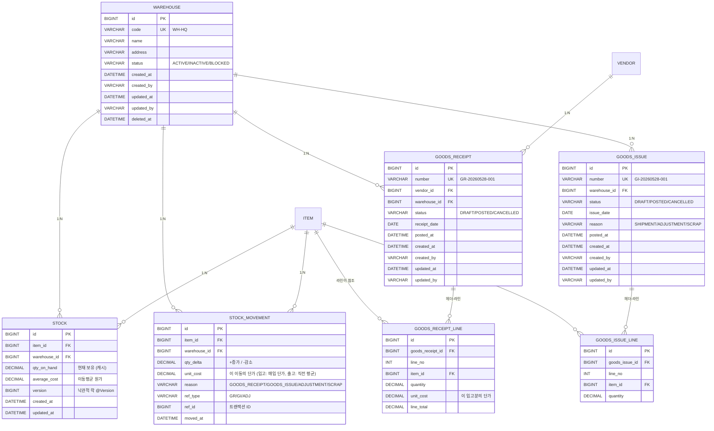

# Phase 3 모델링 제안 — MM(자재/재고) 트랜잭션 설계

> 7단계 사이클의 **3단계: 모델링 제안**.
> 도메인 브리핑(`1-도메인-브리핑.md`)에서 정리한 4개 핵심 개념(창고 / 재고 / 재고 이동 / 입출고)과 동시성 학습 포인트(비관적 락 vs 낙관적 락)를 **ERD / 엔티티 / 락 전략 / API / 마이그레이션 계획**으로 변환한다.
> 코드 한 줄 쓰기 전에 "어디까지 구현하고, 무엇은 Phase 4 에 미룰지" 결정한다.
> 이 문서 마지막의 **승인 체크리스트** 에 사용자가 OK 하면 단계 5(코드 구현)로 진입한다.

---

## 0. 한눈에 — 이번 설계의 핵심 결정 12개

| # | 결정 | 한 줄 이유 |
| --- | --- | --- |
| 1 | 1개 마스터(`Warehouse`) + 1개 캐시(`Stock`) + 1개 원장(`StockMovement`) + 2개 트랜잭션(`GoodsReceipt`, `GoodsIssue`) | 도메인 브리핑 §5의 "만들 것" 6개 중 `StockTransfer` 는 **Phase 3 범위 밖** (선택 항목) |
| 2 | `Warehouse` 는 `BaseEntityWithCode` 상속 (Phase 1 마스터 패턴 그대로) | 코드 자동 발급 / Soft Delete / status — 마스터의 표준 |
| 3 | `Stock` 은 **상품 × 창고** 의 한 행, `(item_id, warehouse_id)` UNIQUE | "현재 재고" 의 단일 진실. 행이 없으면 = 0 으로 해석 (필요 시 INSERT) |
| 4 | `Stock.qty_on_hand` 는 캐시, `StockMovement` 가 진실의 원천 | Phase 2 의 `shippedQty` (캐시) vs `Delivery` 행 (진실) 과 같은 구조 |
| 5 | **출고 경로(`GoodsIssue`)는 비관적 락 `PESSIMISTIC_WRITE`** | 같은 (item, warehouse) 동시 차감 race 를 원천 차단 — MM 의 핵심 학습 |
| 6 | **입고 경로(`GoodsReceipt`)는 낙관적 락(`@Version`)** | 충돌이 드물고, 충돌나도 재시도 안전 — 두 락 패턴을 한 도메인에서 비교 |
| 7 | `Stock` 엔티티에 **`@Version` 박아둠** + 출고 경로는 추가로 `SELECT FOR UPDATE` | 두 락이 충돌하지 않는다 (낙관락이 기본 보호, 비관락은 강한 경로에서 가산) |
| 8 | `StockMovement` 는 **append-only** (수정/삭제 없음), `qty_delta` 부호 하나로 입/출고 모두 표현 | 회계 원장과 같은 패턴. 추상화의 힘 — 새 이동 유형 (조정/폐기) 도 한 테이블에 |
| 9 | **음수 재고 금지** — 가용 재고 < 요청 수량이면 출고 거부 (409 `INSUFFICIENT_STOCK`) | Phase 2 의 신용한도와 같은 패턴 |
| 10 | 재고 평가는 **평균법 (이동평균)** — `GoodsReceipt` 시점에 `Stock.average_cost` 갱신, `GoodsIssue` 는 현재 평균 단가 그대로 사용 | FIFO 는 학습 범위 밖. Phase 5 매출원가 계산의 기반 |
| 11 | 트랜잭션 번호 = **prefix + YYYYMMDD + NNN** (`GR-20260528-001`, `GI-20260528-001`) | Phase 2 의 `code_sequence + period_key` 패턴 그대로 재사용 |
| 12 | **Phase 2 의 `Delivery.ship()` 은 이 Phase 에서 건드리지 않는다** | SD ↔ MM 자동 연계는 Phase 4 의 ⭐ 학습 주제. Phase 3 은 MM 자체만 완성 |

---

## 1. 전체 ERD



핵심 관찰:
- **`Item / Vendor` 는 Phase 1 마스터** — 그대로 재사용, 변경 없음.
- **`Stock` 은 `(item_id, warehouse_id)` UNIQUE** — 같은 노트북이 본사창고와 지방창고에 있으면 두 행. 같은 (상품, 창고) 조합은 절대 두 행이 안 됨 (UNIQUE 제약).
- **`StockMovement` 는 FK 가 헤더(`GR`, `GI`)로 직접 안 향한다** — `ref_type + ref_id` 의 약한 참조. 이유: 미래에 새 이동 유형 (조정, 폐기, Phase 4 의 `Delivery` 연동 등) 이 추가될 때마다 FK 컬럼을 늘리지 않기 위함. 회계 원장과 같은 패턴.
- **`GoodsReceipt` 는 `vendor_id` 필수, `GoodsIssue` 는 `vendor_id` 없음** — 입고는 "어디서 사 왔는가" 가 의미가 있고, 출고는 "어디로 보냈는가" 가 다양 (Phase 4 에서 `Delivery` 연동되면 SO 가 그 정보를 들고 있음).
- **`StockMovement.unit_cost`** — 입고는 매입 단가, 출고는 그 시점의 `Stock.average_cost`. Phase 5 매출원가 계산의 원자료.

---

## 2. 베이스 엔티티 — Stock 의 특수성

### 2.1 4개 엔티티의 베이스 선택

| 엔티티 | 베이스 | Soft Delete | 이유 |
| --- | --- | --- | --- |
| `Warehouse` | `BaseEntityWithCode` | O | 마스터 — Phase 1 패턴 |
| `Stock` | `BaseEntity` | X | 캐시. "삭제" 개념 없음 (수량 0 이 곧 "없음"). 자동 `version` 컬럼은 `@Version` 으로 별도 |
| `StockMovement` | `BaseEntity` | X | append-only 원장. 수정/삭제 자체가 금지 |
| `GoodsReceipt / GoodsIssue` | `BaseEntity` | X | 트랜잭션. Phase 2 의 `Quotation/SalesOrder/...` 와 같은 정책 — `CANCELLED` 상태로 |

### 2.2 `Stock` 만 다른 점 — `@Version`

```java
@Entity
@Table(
    name = "stock",
    uniqueConstraints = @UniqueConstraint(columnNames = {"item_id", "warehouse_id"})
)
public class Stock extends BaseEntity {
    @ManyToOne(fetch = LAZY) @JoinColumn(name = "item_id", nullable = false)
    private Item item;

    @ManyToOne(fetch = LAZY) @JoinColumn(name = "warehouse_id", nullable = false)
    private Warehouse warehouse;

    @Column(name = "qty_on_hand", precision = 18, scale = 4, nullable = false)
    private BigDecimal qtyOnHand = BigDecimal.ZERO;

    @Column(name = "average_cost", precision = 15, scale = 2, nullable = false)
    private BigDecimal averageCost = BigDecimal.ZERO;

    @Version  // ⭐ 낙관적 락
    private Long version;
    ...
}
```

- `@Version` 은 모든 UPDATE 에 자동으로 `WHERE version = ?` 조건을 추가. 다른 트랜잭션이 먼저 갱신했으면 0 row affected → `OptimisticLockException`.
- 입고 경로는 이것만으로 보호 (충돌 드물고, 충돌 시 클라이언트가 재시도 가능).
- 출고 경로는 **이것 + `SELECT ... FOR UPDATE`** 둘 다 → 충돌 자체를 막음. (다음 §3 에서 자세히)

### 2.3 `StockMovement` 의 불변성

`StockMovement` 엔티티에는 **변경자 setter 가 없다**. 생성자/팩토리 메서드로만 만들어지고, 한 번 저장되면 그대로 영구 보존. JPA Dirty Checking 에 잡히지 않게 모든 필드를 `final`-스러운 패턴으로:

```java
@Entity
public class StockMovement extends BaseEntity {
    // 모든 setter 비공개. 생성자만 패키지 가시성.
    static StockMovement of(Item item, Warehouse wh, BigDecimal delta,
                             BigDecimal unitCost, MovementReason reason,
                             String refType, Long refId) { ... }
}
```

→ 원장(ledger) 의 신뢰성. Phase 5 회계 전표가 이 행들을 합산해서 매출원가를 산출할 것이므로, 사후 변경이 절대 일어나면 안 됨.

---

## 3. 동시성 보호 — 두 락 패턴의 공존 ⭐

### 3.1 출고 경로 — 비관적 락 (PESSIMISTIC_WRITE)

```java
public interface StockRepository extends JpaRepository<Stock, Long> {

    @Lock(LockModeType.PESSIMISTIC_WRITE)
    @Query("""
        SELECT s FROM Stock s
         WHERE s.item.id = :itemId AND s.warehouse.id = :warehouseId
    """)
    Optional<Stock> findForUpdate(@Param("itemId") Long itemId,
                                  @Param("warehouseId") Long warehouseId);
}
```

`GoodsIssueService.post()` 가 호출하는 흐름:
```
@Transactional
1. 라인별로 stockRepo.findForUpdate(itemId, warehouseId)
   → DB 가 그 행에 락. 다른 트랜잭션의 SELECT FOR UPDATE 는 대기.
2. 가용 재고 검증: stock.qtyOnHand >= line.quantity
   → 부족하면 BusinessException → 409 INSUFFICIENT_STOCK
3. stock.decrease(line.quantity)   // qty_on_hand 차감
4. stockMovementRepo.save(StockMovement.of(..., -line.quantity, ..., GOODS_ISSUE, "GI", giId))
5. goodsIssue.post()  // 상태 DRAFT → POSTED
6. 커밋 → 락 해제
```

→ "10대 재고에 두 출하가 동시에 6, 7 차감 시도" 의 race condition 이 **원천 차단**. 두 번째 트랜잭션은 첫 번째 커밋을 기다린 뒤 `qtyOnHand=4` 를 보고 `INSUFFICIENT_STOCK` 으로 거부.

### 3.2 입고 경로 — 낙관적 락 (@Version)

```java
@Transactional
public void post(Long grId) {
    GoodsReceipt gr = repo.findById(grId).orElseThrow(...);
    for (var line : gr.getLines()) {
        // 락 없이 평범한 조회. 없으면 INSERT.
        Stock stock = stockRepo
            .findByItemIdAndWarehouseId(line.getItem().getId(), gr.getWarehouse().getId())
            .orElseGet(() -> stockRepo.save(Stock.empty(line.getItem(), gr.getWarehouse())));

        stock.receive(line.getQuantity(), line.getUnitCost());
        // 영속성 컨텍스트가 자동으로 UPDATE ... WHERE version = ? 실행
        // 충돌 시 OptimisticLockException → 트랜잭션 전체 롤백
    }
    gr.post();
}
```

→ 입고는 "내가 매입한 것을 받는" 사건. 같은 (item, warehouse) 에 두 입고가 동시 발생할 확률 낮음. 충돌나면 깔끔하게 트랜잭션 전체 롤백 + 클라이언트가 재시도. 데드락도, 대기도 없다.

### 3.3 두 락이 충돌하지 않는 이유

- 출고가 `SELECT FOR UPDATE` 로 락 잡고 있는 동안, 입고의 평범한 UPDATE 는 락 대기.
- 입고가 UPDATE 중일 때 출고의 `SELECT FOR UPDATE` 도 락 대기.
- 즉 **두 패턴이 한 행을 두고 만나면 자연스럽게 직렬화** — DB 의 행 락이 양쪽 패턴 사이의 정합성도 보장.

### 3.4 학습 포인트: 언제 어떤 락을 쓰는가

| 상황 | 적합한 락 | 이유 |
| --- | --- | --- |
| 핵심 비즈니스 불변식(음수 재고 금지)이 걸린 경로 | 비관적 락 | 충돌 자체를 막아야 안전 |
| 단순 누적/증가, 충돌이 드문 경로 | 낙관적 락 | 동시성 ↑, 대기/데드락 없음 |
| 사용자 편집 화면 (1초~수분 보유) | 낙관적 락 | 비관적 락은 너무 길게 잡힘 |
| 짧은 트랜잭션 + 비즈니스 룰 검증 | 비관적 락 | 락 짧고 안전 |

> Phase 2 의 신용한도 검증은 의도적으로 락 없이 두었다(`설계 제안 §5.1`) — 그 race condition 을 Phase 3 에서 두 패턴 비교 학습 후 회고하며 "어느 락이 자연스러운가" 직접 판단해 본다. (Phase 4 이후 다듬을 후보.)

---

## 4. 재고 평가 — 이동평균 (Weighted Average)

### 4.1 입고 시 평균 단가 갱신 공식

```
새 평균 = (기존 수량 × 기존 평균 + 입고 수량 × 입고 단가) / (기존 수량 + 입고 수량)
```

`Stock.receive()` 내부:
```java
public void receive(BigDecimal qty, BigDecimal unitCost) {
    BigDecimal newQty = this.qtyOnHand.add(qty);
    if (newQty.signum() == 0) {
        this.averageCost = unitCost;  // 0 → 양수 첫 입고면 입고 단가로
        this.qtyOnHand = newQty;
        return;
    }
    BigDecimal totalValue = this.qtyOnHand.multiply(this.averageCost)
                              .add(qty.multiply(unitCost));
    this.averageCost = totalValue.divide(newQty, 2, RoundingMode.HALF_UP);
    this.qtyOnHand = newQty;
}
```

### 4.2 출고는 평균 단가 그대로

```java
public BigDecimal issue(BigDecimal qty) {
    if (this.qtyOnHand.compareTo(qty) < 0) {
        throw new InsufficientStockException(item, warehouse, qtyOnHand, qty);
    }
    this.qtyOnHand = this.qtyOnHand.subtract(qty);
    return this.averageCost;  // 이 출고의 단가 — StockMovement.unit_cost 에 기록됨
}
```

→ 출고 시점의 평균 단가가 `StockMovement` 에 박힘. Phase 5 매출원가 계산 시 `SUM(qty_delta × unit_cost) WHERE reason='GOODS_ISSUE'` 가 그대로 사용 가능.

### 4.3 음수 재고는 금지 — 음수 평균은 발생 자체 불가

음수 재고를 막으면 (`§3.1` 의 검증) `qty_on_hand` 가 항상 ≥ 0 → 나누기 0 우려는 0 → 0 → 0 케이스만 (생성 직후). 그 케이스는 위 `newQty.signum() == 0` 분기로 처리.

### 4.4 학습 노트 — FIFO 와의 차이

- FIFO: 입고 행마다 "남은 수량" 을 추적. 출고 시 가장 오래된 입고 행부터 차감 → `StockMovement` 가 아닌 `StockLot` (입고분 단위 행) 이 필요. 행 수가 폭증.
- 평균법: 단일 `Stock` 행에 누적된 평균만 보유. 행 수 일정.
- 회계 기준 차이: 같은 매입/판매 시퀀스라도 매출원가가 다름. 한국 K-IFRS 는 둘 다 허용.

Phase 3 에서는 **평균법만 구현**, 코드 워크스루에서 "FIFO 라면 어디가 달라질까" 를 글로 짚는 정도.

---

## 5. 각 엔티티별 상세 설계

### 5.1 Warehouse (창고 마스터)

| 컬럼 | 타입 | 비고 |
| --- | --- | --- |
| `id` | BIGINT PK | 베이스 |
| `code` | VARCHAR(30) UK NOT NULL | **수동 입력** (`WH-HQ`, `WH-BUS`) — Department 와 같은 방침 |
| `name` | VARCHAR(200) NOT NULL | "본사창고", "부산창고" |
| `address` | VARCHAR(500) NULL | 단일 필드 (Customer 와 같은 단순화) |
| `status` | VARCHAR(16) | 베이스 (ACTIVE/INACTIVE/BLOCKED) |
| (Audit/Soft Delete) | — | 베이스 |

**왜 코드 수동 입력?** — Phase 1 의 Department 와 같은 이유. 창고는 회사 조직과 1:1, 자주 안 만들고, 의미 있는 이름의 코드(`WH-HQ`) 가 더 유용. 자동 시퀀스(`WH-2026-0001`) 는 의미 없음.

### 5.2 Stock (재고 캐시)

| 컬럼 | 타입 | 제약 | 비고 |
| --- | --- | --- | --- |
| `id` | BIGINT PK |  |  |
| `item_id` | BIGINT FK NOT NULL | UNIQUE(item,wh) | Item |
| `warehouse_id` | BIGINT FK NOT NULL | UNIQUE(item,wh) | Warehouse |
| `qty_on_hand` | DECIMAL(18,4) NOT NULL DEFAULT 0 |  | 현재 보유 (캐시) |
| `average_cost` | DECIMAL(15,2) NOT NULL DEFAULT 0 |  | 이동평균 원가 |
| `version` | BIGINT NOT NULL DEFAULT 0 |  | `@Version` 낙관 락 |
| `created_at / updated_at` | DATETIME | — | 베이스 (생성/수정 자만 — Stock 은 시스템이 갱신하므로 audit 필드는 BaseEntity 의 created/updated 시각만 의미 있음) |

**비즈니스 규칙:**
- `qty_on_hand >= 0` (DB CHECK 제약 추가 — `CHECK (qty_on_hand >= 0)`)
- `average_cost >= 0`
- `(item_id, warehouse_id)` UNIQUE

**Stock 행의 생애:**
- 첫 입고 시 INSERT (`qty=qty_input, avg=unit_cost`)
- 이후 입고는 UPDATE (`qty += delta, avg = 가중평균`)
- 출고는 UPDATE (`qty -= delta, avg 불변`)
- `qty = 0` 이 되어도 행은 남는다 (Soft delete 아님 — 그냥 0)

### 5.3 StockMovement (재고 이동 원장)

| 컬럼 | 타입 | 비고 |
| --- | --- | --- |
| `id` | BIGINT PK |  |
| `item_id` | BIGINT FK NOT NULL |  |
| `warehouse_id` | BIGINT FK NOT NULL |  |
| `qty_delta` | DECIMAL(18,4) NOT NULL | + 입고 / − 출고 |
| `unit_cost` | DECIMAL(15,2) NOT NULL | 이 이동의 단가 |
| `reason` | VARCHAR(20) NOT NULL | enum `GOODS_RECEIPT / GOODS_ISSUE / ADJUSTMENT_PLUS / ADJUSTMENT_MINUS / SCRAP` |
| `ref_type` | VARCHAR(10) NULL | `GR / GI / ADJ` (NULL 허용 — 향후 외부 시스템 유래도 가능) |
| `ref_id` | BIGINT NULL | 트랜잭션 ID (해당 트랜잭션의 행 ID) |
| `moved_at` | DATETIME NOT NULL | 이동 일시 |

**인덱스 설계:**
- `IDX (item_id, warehouse_id, moved_at)` — "특정 상품의 특정 창고 이력 시간순" 조회 (가장 흔한 쿼리)
- `IDX (ref_type, ref_id)` — "특정 GR/GI 의 이동 행들" 역추적

**불변 조건:**
- `qty_delta != 0`
- `reason` 의 부호 = `qty_delta` 의 부호 (`GOODS_RECEIPT / ADJUSTMENT_PLUS` 는 양수, 나머지는 음수)

**정합성 검증 (배치/테스트):**
```sql
-- 모든 (item, warehouse) 에 대해 SUM(qty_delta) == Stock.qty_on_hand 여야 함
SELECT m.item_id, m.warehouse_id, SUM(m.qty_delta) AS ledger_qty, s.qty_on_hand
  FROM stock_movement m
  JOIN stock s ON s.item_id = m.item_id AND s.warehouse_id = m.warehouse_id
 GROUP BY m.item_id, m.warehouse_id, s.qty_on_hand
HAVING SUM(m.qty_delta) <> s.qty_on_hand
```
이 쿼리가 0행이어야 한다 — 통합 테스트에서 시나리오 종료 후 검증.

### 5.4 GoodsReceipt (입고) — 헤더-라인

| 컬럼 | 타입 | 비고 |
| --- | --- | --- |
| `number` UK | `GR-20260528-001` | code_sequence 발급 |
| `vendor_id` FK NOT NULL | Vendor | 누구에게 받았는가 |
| `warehouse_id` FK NOT NULL | Warehouse | 어느 창고로 |
| `status` | `DRAFT / POSTED / CANCELLED` | |
| `receipt_date` DATE NOT NULL | 입고일 | |
| `posted_at` DATETIME NULL | 확정 시각 | |

**상태 전이:**
```
DRAFT
  │ post()  [라인 비어있지 않음, 모든 라인 qty > 0 검증]
  ▼          → 라인별로 Stock.receive() + StockMovement(+) 기록
POSTED
  │ cancel()  [현재 Stock 에서 차감 가능한지 검증]
  ▼          → 라인별로 Stock.issue() + StockMovement(−, reason=ADJUSTMENT_MINUS, ref=GR) 기록
CANCELLED
```

**입고 취소의 미묘함** — 이미 평균 단가에 녹은 매입을 되돌리려면? Phase 3 단순화:
- 취소 시점에 `Stock.qty_on_hand >= cancel_qty` 면 가능 (그 사이 출고로 이미 빠졌으면 거부)
- 평균 단가는 **건드리지 않음** (정확한 역산이 어려움 — 실무에서도 보통 평균은 그대로 두고 보정 분개로 해결). 학습 노트로 남김.
- `StockMovement` 는 음수 행을 추가 (취소를 또 다른 사건으로 기록). 원장은 추가만, 절대 수정/삭제하지 않는다.

#### GoodsReceipt Line
| 컬럼 | 비고 |
| --- | --- |
| `goods_receipt_id` FK |  |
| `line_no` | 1, 2, 3... |
| `item_id` FK NOT NULL | Item |
| `quantity` DECIMAL(18,4) NOT NULL | 입고량 |
| `unit_cost` DECIMAL(15,2) NOT NULL | 이 입고의 단가 |
| `line_total` DECIMAL(15,2) NOT NULL | qty × unit_cost |

### 5.5 GoodsIssue (출고) — 헤더-라인

| 컬럼 | 비고 |
| --- | --- |
| `number` UK | `GI-20260528-001` |
| `warehouse_id` FK NOT NULL | 어느 창고에서 |
| `status` | `DRAFT / POSTED / CANCELLED` |
| `issue_date` DATE NOT NULL | 출고일 |
| `reason` | enum `SHIPMENT / ADJUSTMENT / SCRAP` — 왜 빠지는가 |
| `posted_at` DATETIME NULL |  |

**Phase 3 의 출고는 vendor/customer 정보를 안 갖는다** — Phase 4 에서 `Delivery → GoodsIssue` 자동 발행이 들어가면 `Delivery.id` 가 reference 로 들어옴. 지금은 단순히 "이 창고에서 이 수량을 뺀다" 만.

**상태 전이:**
```
DRAFT
  │ post()  [stockRepo.findForUpdate() 로 비관 락 → 가용 재고 검증 → 차감]
  ▼
POSTED
  │ cancel()  [Stock 에 다시 더함 — 평균은 건드리지 않음]
  ▼
CANCELLED
```

#### GoodsIssue Line
| 컬럼 | 비고 |
| --- | --- |
| `goods_issue_id` FK |  |
| `line_no` |  |
| `item_id` FK NOT NULL |  |
| `quantity` DECIMAL(18,4) NOT NULL | 출고량 |

**검증**: `quantity > 0` 이고 `post()` 시점에 가용 재고 ≥ quantity.

---

## 6. 트랜잭션 번호 발급

Phase 2 의 `TransactionNumberGenerator` 를 그대로 확장:

```java
public String nextGoodsReceiptNumber(LocalDate date) {
    return delegate.nextCode("GR", date.format(YYYYMMDD));
}
public String nextGoodsIssueNumber(LocalDate date) {
    return delegate.nextCode("GI", date.format(YYYYMMDD));
}
```

`code_sequence` 테이블에 `(GR, 20260528, 1)`, `(GI, 20260528, 1)` 행이 자동으로 생긴다. 기존 비관적 락 동시성 패턴 그대로 재사용.

---

## 7. REST API 설계

### 7.1 Warehouse — Phase 1 마스터 패턴

| 메서드 | 경로 | 설명 |
| --- | --- | --- |
| POST | `/api/warehouses` | 생성 (code 수동) |
| GET | `/api/warehouses/{id}` | 단건 |
| GET | `/api/warehouses/by-code/{code}` | 코드로 |
| GET | `/api/warehouses` | 목록 (페이징 + name/status 필터) |
| PUT | `/api/warehouses/{id}` | 수정 |
| DELETE | `/api/warehouses/{id}` | Soft Delete |

### 7.2 Stock — 조회 전용

| 메서드 | 경로 | 설명 |
| --- | --- | --- |
| GET | `/api/stocks` | 목록 (필터: warehouseId, itemId, qtyGt=0) |
| GET | `/api/stocks/by-item/{itemId}` | 상품 한 종의 전 창고 보유 현황 |
| GET | `/api/stocks/by-warehouse/{warehouseId}` | 한 창고의 모든 상품 |

Stock 은 **외부에서 직접 수정 불가** — 입고/출고/조정만이 Stock 을 변경한다. `PUT /stocks/{id}` 없음.

### 7.3 StockMovement — 조회 전용 (감사 추적)

| 메서드 | 경로 | 설명 |
| --- | --- | --- |
| GET | `/api/stock-movements` | 목록 (필터: itemId, warehouseId, reason, dateFrom/To) |
| GET | `/api/stock-movements/{id}` | 단건 |

### 7.4 GoodsReceipt

| 메서드 | 경로 | 설명 |
| --- | --- | --- |
| POST | `/api/goods-receipts` | 입고 등록 (DRAFT) |
| GET | `/api/goods-receipts/{id}` |  |
| GET | `/api/goods-receipts` | 목록 |
| PUT | `/api/goods-receipts/{id}` | 수정 (DRAFT 한정) |
| POST | `/api/goods-receipts/{id}/post` | DRAFT → POSTED (Stock 갱신, Movement 기록) |
| POST | `/api/goods-receipts/{id}/cancel` | 취소 |

### 7.5 GoodsIssue

| 메서드 | 경로 | 설명 |
| --- | --- | --- |
| POST | `/api/goods-issues` | 출고 등록 (DRAFT) |
| GET | `/api/goods-issues/{id}` |  |
| GET | `/api/goods-issues` | 목록 |
| PUT | `/api/goods-issues/{id}` | 수정 (DRAFT) |
| POST | `/api/goods-issues/{id}/post` | DRAFT → POSTED (재고 부족 시 409) |
| POST | `/api/goods-issues/{id}/cancel` | 취소 |

### 7.6 에러 매핑

| 상황 | HTTP | code (ProblemDetail) |
| --- | --- | --- |
| 재고 부족 | 409 | `INSUFFICIENT_STOCK` + `available=4, requested=7` |
| 낙관 락 충돌 | 409 | `OPTIMISTIC_LOCK_CONFLICT` (재시도 안내) |
| 음수 라인 수량 | 400 | `INVALID_QUANTITY` |
| 상태 위반 (`POSTED 를 다시 post`) | 409 | `INVALID_STATE_TRANSITION` |
| 자원 없음 | 404 | `NOT_FOUND` |

---

## 8. 패키지 구조

```
hwlee-erp/src/main/java/com/hwlee/erp/
└─ mm/                  ← 새 모듈
   ├─ warehouse/                  ← Phase 1 마스터 패턴
   │  ├─ Warehouse.java
   │  ├─ WarehouseRepository.java
   │  ├─ WarehouseService.java
   │  ├─ WarehouseController.java
   │  ├─ WarehouseMapper.java
   │  ├─ WarehouseSpecifications.java
   │  └─ dto/
   ├─ stock/                      ← 캐시 + 이력
   │  ├─ Stock.java
   │  ├─ StockRepository.java     ← findForUpdate 포함
   │  ├─ StockService.java        ← 조회 전용 외부 API + 내부 receive/issue 도우미
   │  ├─ StockController.java     ← 조회 전용
   │  ├─ StockMovement.java
   │  ├─ StockMovementRepository.java
   │  ├─ StockMovementController.java
   │  ├─ MovementReason.java (enum)
   │  └─ dto/
   ├─ goodsreceipt/
   │  ├─ GoodsReceipt.java
   │  ├─ GoodsReceiptLine.java
   │  ├─ GoodsReceiptStatus.java
   │  ├─ GoodsReceiptRepository.java
   │  ├─ GoodsReceiptService.java   ← Stock.receive() + Movement 기록
   │  ├─ GoodsReceiptController.java
   │  ├─ GoodsReceiptMapper.java
   │  └─ dto/
   └─ goodsissue/
      ├─ GoodsIssue.java
      ├─ GoodsIssueLine.java
      ├─ GoodsIssueStatus.java
      ├─ GoodsIssueReason.java (enum)
      ├─ GoodsIssueRepository.java
      ├─ GoodsIssueService.java     ← stockRepo.findForUpdate() + 비관 락 차감
      ├─ GoodsIssueController.java
      ├─ GoodsIssueMapper.java
      └─ dto/
```

원칙: Phase 1/2 와 동일한 5단(`controller/service/엔티티/리포지토리/dto`) 구조.

---

## 9. 마이그레이션 계획 (Flyway V15 ~)

| 버전 | 파일명 | 내용 |
| --- | --- | --- |
| V15 | `V15__create_warehouse.sql` | warehouse 테이블 + 인덱스, 시드 행 (`WH-HQ` 본사창고) |
| V16 | `V16__create_stock.sql` | stock 테이블, `(item_id, warehouse_id)` UNIQUE, `qty_on_hand >= 0` CHECK, `version` 컬럼 |
| V17 | `V17__create_stock_movement.sql` | stock_movement 테이블 + 두 인덱스 |
| V18 | `V18__create_goods_receipt.sql` | goods_receipt, goods_receipt_line |
| V19 | `V19__create_goods_issue.sql` | goods_issue, goods_issue_line |
| V20 | `V20__seed_mm_demo.sql` | 시연용 초기 입고 — Phase 2 시연에서 가져간 노트북 (이미 시드된 SO) 의 재고 보충용. 예: 노트북 50대 @ 100만원 입고 1건 시드 |

**왜 시드에 입고가 있나** — Phase 2 시연 때는 SO 만 만들고 출하는 SO 라인의 `shipped_qty` 만 갱신했다. Phase 3 시연에서 "실제로 재고가 빠지는" 흐름을 보려면 시작 재고가 필요. V20 시드가 그것을 제공.

**시드는 무엇이 아닌가** — `GoodsReceipt` 행을 시드해서 `post()` 흐름을 거치게 하지 않는다 (시드 SQL 은 도메인 메서드를 못 부름). 대신:
1. `goods_receipt` + `goods_receipt_line` 직접 INSERT (status=POSTED)
2. `stock` 직접 INSERT (qty=50, avg=100만)
3. `stock_movement` 직접 INSERT (delta=+50, reason=GOODS_RECEIPT, ref=GR id)

→ 데이터 정합성을 SQL 차원에서 직접 맞춤. 한 트랜잭션 안에서.

---

## 10. 테스트 전략

### 10.1 단위 테스트 (도메인 메서드 중심)

`StockTest`:
- `receive_첫_입고는_입고_단가를_평균으로_세팅`
- `receive_두번째_입고는_가중평균으로_갱신`
- `issue_가용_재고_미만이면_InsufficientStockException`
- `issue_평균_단가는_그대로_유지`

`GoodsReceiptTest`:
- `post_라인이_비어있으면_거부`
- `post_DRAFT가_아니면_거부`
- `cancel_POSTED_가_아니면_거부`

`GoodsIssueTest`:
- 동일 패턴

`StockMovementTest`:
- `qty_delta_0_이면_거부`
- `reason_GOODS_RECEIPT_인데_qty_delta_음수면_거부`

### 10.2 통합 테스트 (Testcontainers)

`GoodsReceiptIntegrationTest`:
- 첫 입고 시 `stock` 행 INSERT, `qty_on_hand=10, avg_cost=100`
- 두 번째 입고 (`qty=10 @ 120`) 시 `qty=20, avg=110` (가중평균)
- `stock_movement` 행 2개 추가

`GoodsIssueIntegrationTest`:
- 재고 20 에서 출고 7 → `qty=13`
- `stock_movement` 행 추가, `unit_cost=110` (직전 평균)
- 재고 13 에서 출고 14 시도 → 409 `INSUFFICIENT_STOCK`

`StockLedgerConsistencyTest`:
- 입고/출고/취소 시나리오 5단계 진행 후
- `SUM(stock_movement.qty_delta) == stock.qty_on_hand` 정합성 검증 (§5.3 의 쿼리)

`ConcurrentGoodsIssueTest` ⭐ — Phase 3 의 하이라이트:
- 시작: 재고 10대
- 8 개 스레드가 각자 2대씩 동시 출고 시도 (총 요청 16대)
- 기대: 5개 스레드는 성공 (10대 = 5 × 2), 3개는 `INSUFFICIENT_STOCK` 거부
- `stock.qty_on_hand == 0` 으로 종료. 음수 발생하지 않음.

`OptimisticLockReceiptTest`:
- 두 스레드가 같은 Stock 에 동시 입고 → 한쪽은 `OptimisticLockException` → 클라이언트가 재시도하면 정합성 유지

`TransactionNumberConcurrencyTest`:
- Phase 1/2 패턴 그대로 — GR/GI 도 같은 날짜 50개 동시 등록 시 번호 중복 없음

### 10.3 테스트가 곧 명세

```java
@Test void 입고는_상품X창고당_평균_단가를_가중평균으로_갱신한다()
@Test void 출고는_가용_재고_미만이면_거부된다()
@Test void 동시_출고_요청은_비관적_락으로_직렬화되어_음수_재고가_발생하지_않는다()
@Test void 동시_입고_요청은_낙관적_락으로_충돌_시_한쪽이_재시도_대상이_된다()
@Test void StockMovement_합계는_항상_Stock_qty_on_hand_와_일치한다()
```

---

## 11. 의도적으로 미루는 것 (Phase 3 범위 밖)

| 항목 | 미루는 이유 | 도입 시점 |
| --- | --- | --- |
| `Delivery → GoodsIssue` 자동 발행 | Phase 3 은 MM 자체 완성, 연계는 Phase 4 의 ⭐ 주제 | Phase 4 |
| `Purchase Order → GoodsReceipt` 자동 발행 | 구매 모듈(Procurement)이 학습 범위 밖 | 학습 범위 밖 |
| `StockTransfer` (창고 간 이동) | 핵심 학습 포인트 외, 두 개의 Movement 행으로 충분히 흉내 가능 | Phase 9 배치 or 후순위 |
| FIFO / LIFO 평가 | 평균법 한 패턴으로 학습 충분 | 학습 범위 밖 |
| 재고 실사 (Cycle Count) | 별도 트랜잭션 + `ADJUSTMENT_*` 의 본격적 활용 | Phase 9 야간 마감 |
| 안전재고 (Safety Stock) / 재주문점 (Reorder Point) | MRP 개념, PP 모듈과 함께 | Phase 8 |
| 로트 / 시리얼 번호 추적 (Batch / Serial) | 추적성 ↑↑ 인데 학습 범위에서 벗어남 | 학습 범위 밖 |
| 위치 (Bin Location) — 창고 내부 위치 | 창고 1개 + 단순화 | 학습 범위 밖 |
| Spring Events 로 모듈 간 결합도 완화 | Phase 4 의 SD↔MM 연계 학습 핵심 | Phase 4 |
| 재고 평가 보정 (감모/평가 손실) | 회계 모듈 필요 | Phase 5 |
| 입고 취소 시 평균 단가 역산 | 어렵고 실무에서도 안 함 — 학습 노트로만 | 학습 범위 밖 |

---

## 12. 승인 체크리스트 ⭐

아래 항목을 짚어보고, **수정/이의 있는 항목이 있으면 번호로 알려 주세요.** 다 OK면 "승인" 이라고 답해 주시면 단계 5(코드 구현)로 진입합니다.

- [ ] **1.** 5개 엔티티 세트: `Warehouse` (마스터) + `Stock` (캐시) + `StockMovement` (원장) + `GoodsReceipt/Line` + `GoodsIssue/Line`. `StockTransfer` 는 Phase 3 범위 밖.
- [ ] **2.** `Warehouse` 는 `BaseEntityWithCode` 상속, **코드 수동 입력** (`WH-HQ` — Department 와 같은 방침).
- [ ] **3.** `Stock` 의 `(item_id, warehouse_id)` UNIQUE 제약, `qty_on_hand >= 0` DB CHECK.
- [ ] **4.** `Stock` 에 `@Version` (낙관적 락) — 입고 경로의 기본 보호.
- [ ] **5.** 출고 경로(`GoodsIssue.post()`) 는 **추가로 `PESSIMISTIC_WRITE`** 적용 — `stockRepo.findForUpdate(...)`.
- [ ] **6.** `StockMovement` 는 append-only — setter 없음, 수정/삭제 자체가 금지.
- [ ] **7.** `StockMovement.ref_type/ref_id` 약한 참조 (FK 아님) — 새 이동 유형이 추가돼도 컬럼 안 늘어남.
- [ ] **8.** 음수 재고 금지 — 가용 재고 < 요청 시 `409 INSUFFICIENT_STOCK` (Phase 2 신용한도와 같은 패턴).
- [ ] **9.** 재고 평가는 **이동평균** — 입고 시 가중평균으로 갱신, 출고는 평균 단가 그대로 사용.
- [ ] **10.** 입고 취소 시 평균 단가는 **건드리지 않음** (수량만 차감, 평균 역산은 학습 범위 밖).
- [ ] **11.** 트랜잭션 번호 `GR-YYYYMMDD-NNN`, `GI-YYYYMMDD-NNN` — Phase 2 `TransactionNumberGenerator` 확장.
- [ ] **12.** API: Stock 은 **조회 전용** (외부에서 직접 수정 불가), StockMovement 도 조회 전용. GR/GI 만 상태 전이 액션 엔드포인트.
- [ ] **13.** 마이그레이션 V15~V20, V20 시드 = 노트북 50대 @ 100만원 초기 입고 (시연 출고 흐름의 시작 재고).
- [ ] **14.** 단위 테스트 = 도메인 메서드(`Stock.receive/issue`), 통합 테스트 = "10대 동시 출고 8개 스레드" 동시성 시나리오 + 원장 정합성 검증.
- [ ] **15.** Phase 2 `Delivery.ship()` 은 이 Phase 에서 **건드리지 않는다** — SD↔MM 연계는 Phase 4.
- [ ] **16.** 패키지 구조 `mm/{warehouse, stock, goodsreceipt, goodsissue}`.
- [ ] **17.** 미루는 것 11개 항목 (Transfer / FIFO / 실사 / 로트 / 위치 / 안전재고 ...).

---

## 13. 다음 단계 안내

승인되면 **단계 5: 코드 구현** 으로 들어갑니다. 다음 산출물:
- `hwlee-erp/src/main/java/com/hwlee/erp/mm/` 아래 4개 모듈, 약 40~45개 Java 파일
- `common/code/` 등 기존 코드는 그대로 — 마이그레이션 V15~V20 만 추가
- 단위 테스트 + 통합 테스트 (동시성 시나리오 포함)
- 그리고 단계 6: **코드 워크스루** 문서 (`3-코드-워크스루/01-창고-마스터.md`, `02-Stock-Movement-원장.md`, `03-비관적-락-출고.md`, `04-낙관적-락-입고.md`, `05-이동평균-원가.md`, `06-Flyway-V15-V20.md`, `07-동시성-테스트.md` 등)

> 도메인 브리핑에서 짚고 싶은 부분이 더 있거나 (자기 점검 5가지 §7), 위 17가지 결정 중 다시 들춰보고 싶은 항목이 있으면 그것부터 풀고 진행해도 됩니다.
